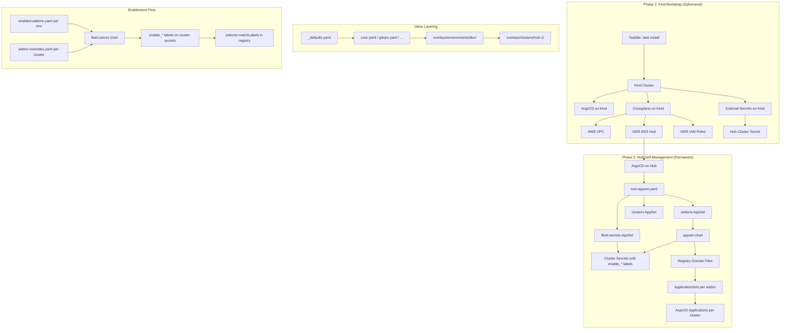
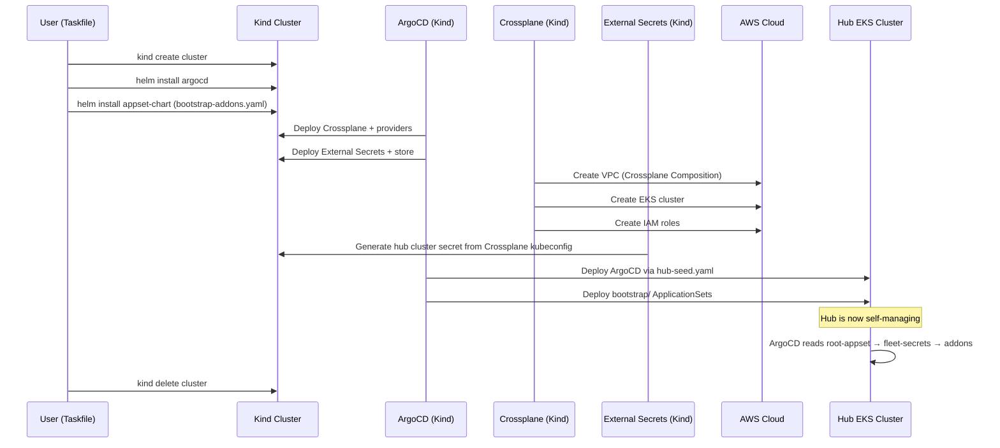
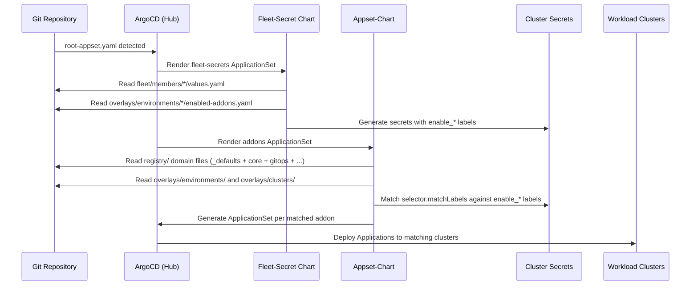
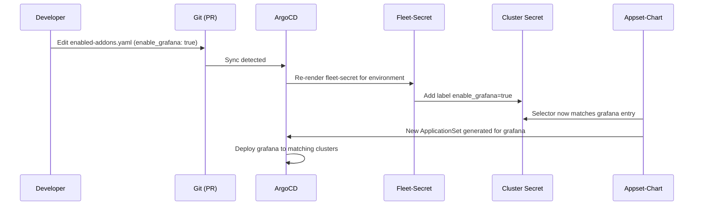

# Design Document: GitOps Addon Management

## Overview

This system provides a complete GitOps-based addon management platform for Kubernetes clusters using ArgoCD ApplicationSets. It replaces a monolithic 1759-line addon registry with a domain-split, selector-driven architecture that enables git-auditable addon enablement per environment and per cluster.

The architecture is built around three core innovations: (1) a unified `appset-chart` Helm chart that renders ArgoCD ApplicationSets from registry entries, (2) domain-split registry files that replace the monolith with ~6 focused YAML files, and (3) a selector-based enablement mechanism where `enabled-addons.yaml` files drive `enable_*` labels on cluster secrets via a fleet-secret chart, which the appset-chart's selectors then match against. A two-phase Kind bootstrap (zero Terraform) provisions the entire platform from a single `task install` command.

## Architecture



## Sequence Diagrams

### Phase 1: Kind Bootstrap Sequence



### Phase 2: Addon Deployment Flow



### Enablement Change Flow



## Components and Interfaces

### Component 1: appset-chart (Unified Helm Chart)

**Purpose**: Renders ArgoCD ApplicationSets from addon registry entries. Based on the Azure reference implementation with improvements merged from the AWS original.

**Interface** (values.yaml schema):
```yaml
# Global configuration
repoURLGit: '{{.metadata.annotations.addonsRepoURL}}'
repoURLGitRevision: '{{.metadata.annotations.addonsRepoRevision}}'
repoURLGitBasePath: '{{.metadata.annotations.addonsRepoBasepath}}'
valueFiles: ["values.yaml"]
useSelectors: true
useValuesFilePrefix: false
appsetPrefix: ""                    # Optional prefix on ApplicationSet names
namespace: argocd                   # Default namespace for ApplicationSets
syncPolicy: { ... }                 # Default Application sync policy
syncPolicyAppSet: { ... }           # Default ApplicationSet sync policy

# Per-addon entry (iterated by range in template)
<addon-name>:
  namespace: <string>               # Required: target namespace (replaces 'enabled' as iteration key)
  chartName: <string>               # Helm chart name (defaults to addon key)
  chartRepository: <string>         # Helm repo URL
  chartNamespace: <string>          # OCI namespace (e.g., aws-controllers-k8s)
  defaultVersion: <string>          # Chart version
  path: <string>                    # Git path (for path-based sources)
  directory: { ... }                # Directory config (for raw manifests)
  releaseName: <string>             # Override Helm release name
  project: <string>                 # ArgoCD project (defaults to "default")
  selector:                         # Cluster selector for enablement
    matchExpressions: [...]
  selectorMatchLabels: { ... }      # Additional label selectors
  annotationsAppSet: { ... }        # Annotations on the ApplicationSet (sync-wave)
  annotationsApp: { ... }           # Annotations on generated Applications
  labelsAppSet: { ... }             # Labels on the ApplicationSet
  valuesObject: { ... }             # Inline Helm values
  valueFiles: [...]                 # Additional value file paths
  additionalResources: [...]        # List of additional sources (not single object)
  ignoreDifferences: [...]          # ArgoCD ignore differences
  syncPolicy: { ... }               # Override sync policy per addon
  syncPolicyAppSet: { ... }         # Override AppSet sync policy per addon
  environments: [...]               # Version overrides per environment
  gitMatrix: <bool>                 # Use git matrix generator
  matrixPath: <string>              # Git file path for matrix
  matrixValues: { ... }             # Values from git matrix
  enableAckPodIdentity: <bool>      # Enable ACK pod identity source
  goTemplateOptions: [...]          # Override go template options
  appSetName: <string>              # Override generated Application name
  resourceGroup: <bool>             # KRO resource group mode
  type: <string>                    # "manifest" to skip helm block
```

**Responsibilities**:
- Iterate over all map entries with a `namespace` key (changed from `enabled`)
- Render one ApplicationSet per addon with cluster selector generators
- Support both Helm chart and git path-based sources
- Support `directory` block for raw manifest sources (restored from AWS original)
- Render `additionalResources` as a list (not single object)
- Apply `appsetPrefix` to ApplicationSet names
- Generate rich Application labels: addonVersion, addonName, environment, clusterName, kubernetesVersion
- Support configurable `project` per addon
- Support `annotationsApp` on generated Applications
- Fix duplicate `ignoreDifferences` bug (use `with` block only)
- Support git matrix generator for advanced use cases
- Support pod-identity with flexible sourcing (not hardcoded paths)

### Component 2: Addon Registry (Domain Files)

**Purpose**: Split the monolithic addons.yaml into domain-specific files for maintainability.

**Interface** (file structure):
```
addons/registry/
├── _defaults.yaml      # Shared defaults (syncPolicy, repoURL, valueFiles, etc.)
├── core.yaml           # argocd, metrics-server, ingress-nginx, cert-manager, external-secrets
├── gitops.yaml         # argo-workflows, argo-events, argo-rollouts, kargo, flux
├── security.yaml       # keycloak, kyverno, cert-manager policies
├── observability.yaml  # grafana, grafana-operator, grafana-dashboards, otel
├── platform.yaml       # crossplane, crossplane-aws, backstage, kro, platform-manifests
└── ml.yaml             # jupyterhub, kubeflow, mlflow, ray-operator, spark-operator, airflow
```

**Responsibilities**:
- No `enabled` field in registry entries — selectors are the enablement mechanism
- Each domain file contains only addon entries relevant to that domain
- `_defaults.yaml` provides shared configuration merged by the addons ApplicationSet valueFiles
- Addon entries use `selector.matchExpressions` with `enable_<addon>` labels

### Component 3: Fleet-Secret Chart (Enhanced)

**Purpose**: Generates ArgoCD cluster secrets with `enable_*` labels derived from `enabled-addons.yaml` files.

**Interface** (values.yaml schema):
```yaml
externalSecret:
  enabled: true
  secretStoreRefKind: ClusterSecretStore
  secretStoreRefName: aws-secrets-manager
  clusterName: <string>
  server: <string>                  # "self" for hub, or template expression
  annotations: { ... }             # Cluster annotations (repo URLs, AWS config, etc.)
  labels: { ... }                  # Static labels (environment, fleet_member, etc.)

# Injected from enabled-addons.yaml via valueFiles
enabledAddons:                      # Map of addon → enabled state
  argocd: true
  metrics_server: true
  ingress_nginx: true
  # ...
```

**Template Enhancement** — generates `enable_*` labels from `enabledAddons` map:
```yaml
# In external-secret.yaml template
{{- range $addon, $enabled := .Values.enabledAddons }}
{{- if $enabled }}
- target: Labels
  literal: "enable_{{ $addon }}: 'true'"
{{- end }}
{{- end }}
```

**Responsibilities**:
- Read `enabledAddons` map from valueFiles (sourced from `enabled-addons.yaml`)
- Generate `enable_*` labels on the cluster secret for each enabled addon
- Support per-cluster overrides via `addon-overrides.yaml`
- Maintain existing ExternalSecret functionality for cluster credentials

### Component 4: Bootstrap (Phase 2 — Hub Self-Management)

**Purpose**: Root ApplicationSets that bootstrap the hub cluster's self-management.

**Interface** (file structure):
```
bootstrap/
├── root-appset.yaml      # App-of-apps: deploys the other three
├── addons.yaml           # Deploys appset-chart with registry valueFiles
├── clusters.yaml         # Deploys cluster provisioning (KRO)
└── fleet-secrets.yaml    # Deploys fleet-secret chart per cluster member
```

**Responsibilities**:
- `root-appset.yaml` is the single entry point applied to the hub
- `addons.yaml` uses a clusters generator matching `fleet_member: control-plane` and renders the appset-chart with layered valueFiles from registry domain files
- `fleet-secrets.yaml` uses a matrix generator (clusters × git directories) to render fleet-secret per member, with valueFiles including the environment's `enabled-addons.yaml`
- `clusters.yaml` deploys KRO-based cluster provisioning

### Component 5: Bootstrap-Kind (Phase 1 — Ephemeral)

**Purpose**: Bootstraps the entire platform from zero using a Kind cluster, Crossplane, and ArgoCD.

**Interface** (file structure):
```
bootstrap-kind/
├── Taskfile.yml              # Entry point: task install / task destroy
├── kind.yaml                 # Kind cluster config
├── config.yaml               # User configuration (AWS region, repo URL, etc.)
├── argocd-values.yaml        # ArgoCD Helm values for Kind
├── bootstrap-addons.yaml     # Addon registry for Kind phase (Crossplane, ESO, ArgoCD)
├── hub-seed.yaml             # Seed ApplicationSet to bootstrap hub
└── manifests/
    ├── argocd/               # ArgoCD additional manifests (repo credentials, projects)
    ├── crossplane/           # Crossplane providers, compositions, claims
    ├── external-secrets/     # SecretStore, ExternalSecret for hub kubeconfig
    └── credentials/          # Template for AWS credentials secret
```

**Responsibilities**:
- `task install` creates Kind cluster, installs ArgoCD, installs appset-chart with bootstrap-addons.yaml
- Crossplane compositions create VPC, EKS, IAM on AWS
- ESO generates hub cluster secret from Crossplane-produced kubeconfig
- hub-seed.yaml deploys ArgoCD + bootstrap/ to the hub
- `task destroy` tears down Kind (hub persists)

### Component 6: Overlays (Environment & Cluster Overrides)

**Purpose**: Git-auditable configuration overrides per environment and per cluster.

**Interface** (file structure):
```
overlays/
├── environments/<env>/
│   ├── enabled-addons.yaml       # Which addons are on/off for this environment
│   └── <addon>/values.yaml       # Value overrides per addon per environment
└── clusters/<cluster>/
    ├── addon-overrides.yaml      # Per-cluster addon enable/disable exceptions
    └── <addon>/values.yaml       # Value overrides per addon per cluster
```

**Responsibilities**:
- `enabled-addons.yaml` is the single source of truth for addon enablement per environment
- Fleet-secret chart reads this via valueFiles to generate labels
- Value overrides are layered: `_defaults → registry → environment → cluster`
- `addon-overrides.yaml` allows per-cluster exceptions to environment-level enablement

## Data Models

### Model 1: Addon Registry Entry

```yaml
# Schema for each addon entry in a registry domain file
<addon-name>:
  # Required
  namespace: <string>                    # Target namespace — also serves as iteration key

  # Source: Helm chart (option A)
  chartName: <string>                    # Chart name (defaults to addon key normalized)
  chartRepository: <string>              # Helm repo URL or OCI registry
  chartNamespace: <string>              # OCI namespace prefix
  defaultVersion: <string>              # Semver chart version

  # Source: Git path (option B)
  path: <string>                        # Git repo path to chart/manifests
  directory:                            # Optional: raw manifest directory config
    recurse: <bool>
    include: <string>
    exclude: <string>

  # Enablement
  selector:
    matchExpressions:
      - key: enable_<addon_name>
        operator: In
        values: ['true']

  # Ordering
  annotationsAppSet:
    argocd.argoproj.io/sync-wave: '<int>'

  # Configuration
  project: <string>                     # ArgoCD project (default: "default")
  releaseName: <string>                 # Override Helm release name
  valuesObject: { ... }                 # Inline Helm values with Go template expressions
  valueFiles: [...]                     # Additional value file paths
  annotationsApp: { ... }              # Annotations on generated Applications
  additionalResources:                  # List of additional sources
    - type: <string>                    # "manifests" or "chart"
      path: <string>
      manifestPath: <string>
      repoURL: <string>
      chart: <string>
      chartVersion: <string>
      helm:
        releaseName: <string>
        valuesObject: { ... }

  # Sync behavior
  syncPolicy: { ... }                  # Override default sync policy
  ignoreDifferences: [...]             # ArgoCD ignore differences
```

**Validation Rules**:
- `namespace` is required (serves as the iteration check instead of `enabled`)
- Either `chartRepository` + `defaultVersion` OR `path` must be specified
- `selector.matchExpressions` should reference `enable_<addon_name>` labels
- `annotationsAppSet` should include `argocd.argoproj.io/sync-wave` for ordering

### Model 2: Enabled Addons Map

```yaml
# overlays/environments/<env>/enabled-addons.yaml
enabledAddons:
  argocd: true
  metrics_server: true
  ingress_nginx: true
  cert_manager: true
  external_secrets: true
  keycloak: false
  grafana: true
  jupyterhub: false
  # ... all addons listed with true/false
```

**Validation Rules**:
- All addon keys must use underscores (matching `enable_<addon>` label convention)
- Values must be boolean true/false
- All known addons should be listed (explicit is better than implicit)

### Model 3: Fleet Member Values

```yaml
# fleet/members/<cluster>/values.yaml
externalSecret:
  enabled: true
  secretStoreRefKind: ClusterSecretStore
  secretStoreRefName: aws-secrets-manager
  clusterName: <cluster-name>
  server: <cluster-api-endpoint>
  annotations:
    addonsRepoURL: <git-repo-url>
    addonsRepoRevision: main
    addonsRepoBasepath: gitops/
    aws_region: <region>
    aws_account_id: <account-id>
    aws_cluster_name: <cluster-name>
    ingress_domain_name: <domain>
    # ... additional annotations
  labels:
    environment: <dev|staging|prod>
    fleet_member: <member-type>
    kubernetesVersion: <version>
```

### Model 4: Bootstrap Config

```yaml
# bootstrap-kind/config.yaml
repo:
  url: <git-repo-url>
  revision: main
  basepath: gitops/
aws:
  region: <region>
  accountId: <account-id>
  profile: <aws-profile>
hub:
  clusterName: <hub-cluster-name>
  kubernetesVersion: "1.32"
  vpcCidr: "10.0.0.0/16"
  instanceTypes: ["m5.xlarge"]
  minSize: 2
  maxSize: 5
  desiredSize: 3
```


## Key Functions with Formal Specifications

### Function 1: ApplicationSet Rendering (application-set.yaml)

```yaml
# Helm template: range over .Values entries where entry has 'namespace' key
{{- range $chartName, $chartConfig := .Values }}
{{- if and (kindIs "map" $chartConfig) (hasKey $chartConfig "namespace") }}
```

**Preconditions:**
- `.Values` contains at least one map entry with a `namespace` key
- `repoURLGit`, `repoURLGitRevision` are non-empty strings (from cluster annotations)
- `syncPolicy` and `syncPolicyAppSet` are valid ArgoCD sync policy objects
- If `chartConfig.path` is set, it points to a valid git path
- If `chartConfig.chartRepository` is set, it's a reachable Helm repo URL

**Postconditions:**
- One `ApplicationSet` resource is rendered per addon entry with a `namespace` key
- ApplicationSet name = `{appsetPrefix}{nameNormalize}` (underscores replaced with hyphens, truncated to 63 chars)
- Generated Application template includes labels: `addonVersion`, `addonName`, `environment`, `clusterName`, `kubernetesVersion`
- If `chartConfig.project` is set, Application uses that project; otherwise defaults to `"default"`
- If `chartConfig.annotationsApp` is set, annotations are rendered on the Application template
- `ignoreDifferences` is rendered exactly once (via `with` block, not duplicated)
- If `chartConfig.directory` is set and `chartConfig.path` is set, directory block is rendered on the source

**Loop Invariants:**
- Each iteration produces exactly one `---` separated YAML document
- No iteration modifies global template state

### Function 2: Additional Resources Rendering (_application_set.tpl)

```yaml
# List-based iteration over additionalResources
{{- range $resource := $chartConfig.additionalResources }}
```

**Preconditions:**
- `$chartConfig.additionalResources` is a list (not a single object)
- Each resource has either `type: manifests` with `manifestPath`, or `path`, or `repoURL` + `chart`
- `$values.repoURLGit` and `$values.repoURLGitRevision` are non-empty

**Postconditions:**
- One additional source entry is rendered per list item
- Manifest-type resources use `repoURLGitBasePath` for path construction
- Chart-type resources use the resource's own `repoURL` and `chart`
- Each resource with `helm` config gets its own `releaseName`, `valuesObject`, and `valueFiles`

### Function 3: Fleet-Secret Label Generation

```yaml
# Generate enable_* labels from enabledAddons map
{{- range $addon, $enabled := .Values.enabledAddons }}
{{- if $enabled }}
```

**Preconditions:**
- `.Values.enabledAddons` is a map of string → boolean
- Addon keys use underscores (e.g., `ingress_nginx`)
- ExternalSecret target template supports multiple `literal` entries for Labels

**Postconditions:**
- For each addon where `$enabled == true`, a label `enable_<addon>: 'true'` is added to the cluster secret
- For addons where `$enabled == false`, no label is generated (absence = disabled)
- Labels are additive — they don't remove existing labels on the secret
- The `argocd.argoproj.io/secret-type: cluster` label is always present

### Function 4: Value Layering Resolution

```yaml
# valueFiles ordering in addons.yaml ApplicationSet
valueFiles:
  - $values/gitops/addons/registry/_defaults.yaml
  - $values/gitops/addons/registry/core.yaml
  - $values/gitops/addons/registry/gitops.yaml
  - $values/gitops/addons/registry/security.yaml
  - $values/gitops/addons/registry/observability.yaml
  - $values/gitops/addons/registry/platform.yaml
  - $values/gitops/addons/registry/ml.yaml
  - $values/gitops/overlays/environments/{{.metadata.labels.environment}}/overrides.yaml
  - $values/gitops/overlays/clusters/{{.name}}/overrides.yaml
```

**Preconditions:**
- `_defaults.yaml` exists and contains valid YAML with shared defaults
- At least one domain file exists with addon entries
- `ignoreMissingValueFiles: true` is set (overlay files may not exist)

**Postconditions:**
- Values are merged in order: defaults → domain files → environment overlays → cluster overlays
- Later files override earlier files for the same keys
- Missing overlay files are silently ignored
- The final merged values contain all addon entries from all domain files

### Function 5: Bootstrap Taskfile Orchestration

```yaml
# Taskfile.yml: task install
tasks:
  install:
    cmds:
      - kind create cluster --config kind.yaml
      - helm install argocd argo/argo-cd -n argocd --create-namespace -f argocd-values.yaml
      - helm install bootstrap ../appset-chart -n argocd -f bootstrap-addons.yaml
      - task: wait-for-hub
      - kind delete cluster
```

**Preconditions:**
- `kind`, `helm`, `kubectl`, `aws` CLI tools are installed
- AWS credentials are configured (via profile or environment)
- `config.yaml` is populated with valid AWS and repo configuration
- Docker is running (for Kind)

**Postconditions:**
- Hub EKS cluster exists and is self-managing via ArgoCD
- Hub ArgoCD has bootstrap/ ApplicationSets deployed
- Kind cluster is deleted
- All AWS resources (VPC, EKS, IAM) are managed by hub Crossplane
- Hub Crossplane has adopted all resources via `crossplane.io/external-name`

## Algorithmic Pseudocode

### Algorithm 1: Addon Enablement Resolution

```pascal
ALGORITHM resolveAddonEnablement(cluster, environment)
INPUT: cluster (ClusterMember), environment (string)
OUTPUT: enabledLabels (map[string]string)

BEGIN
  // Step 1: Load environment-level enabled addons
  envAddons ← loadYAML("overlays/environments/" + environment + "/enabled-addons.yaml")

  // Step 2: Load cluster-level overrides (if exists)
  clusterOverrides ← loadYAML("overlays/clusters/" + cluster.name + "/addon-overrides.yaml")

  // Step 3: Merge with cluster overrides taking precedence
  mergedAddons ← MERGE(envAddons.enabledAddons, clusterOverrides.enabledAddons)

  // Step 4: Generate enable_* labels
  enabledLabels ← {}
  FOR EACH addon, isEnabled IN mergedAddons DO
    ASSERT addon matches pattern [a-z_]+
    IF isEnabled = true THEN
      enabledLabels["enable_" + addon] ← "true"
    END IF
  END FOR

  RETURN enabledLabels
END
```

**Preconditions:**
- Environment directory exists with enabled-addons.yaml
- Cluster overrides file may or may not exist

**Postconditions:**
- enabledLabels contains only labels for addons that are enabled
- Cluster overrides take precedence over environment defaults
- All label keys follow the pattern `enable_<addon_name>`

**Loop Invariants:**
- All previously processed addons have correct enable/disable state

### Algorithm 2: ApplicationSet Generation Pipeline

```pascal
ALGORITHM generateApplicationSets(registryFiles, clusterSecrets)
INPUT: registryFiles (list of YAML files), clusterSecrets (list of K8s Secrets)
OUTPUT: applicationSets (list of ApplicationSet resources)

BEGIN
  // Step 1: Merge all registry files with defaults
  mergedValues ← loadYAML("_defaults.yaml")
  FOR EACH file IN registryFiles DO
    fileValues ← loadYAML(file)
    mergedValues ← DEEP_MERGE(mergedValues, fileValues)
  END FOR

  // Step 2: Iterate addon entries
  applicationSets ← []
  FOR EACH addonName, addonConfig IN mergedValues DO
    IF NOT isMap(addonConfig) OR NOT hasKey(addonConfig, "namespace") THEN
      CONTINUE  // Skip non-addon entries (syncPolicy, repoURLGit, etc.)
    END IF

    nameNormalized ← REPLACE(addonName, "_", "-")
    nameNormalized ← TRUNCATE(nameNormalized, 63)

    // Step 3: Build generator
    IF addonConfig.gitMatrix THEN
      generator ← buildGitMatrixGenerator(addonConfig, mergedValues)
    ELSE
      generator ← buildClusterGenerator(addonConfig, mergedValues)
    END IF

    // Step 4: Build template
    template ← buildApplicationTemplate(nameNormalized, addonConfig, mergedValues)

    // Step 5: Assemble ApplicationSet
    appSet ← {
      apiVersion: "argoproj.io/v1alpha1",
      kind: "ApplicationSet",
      metadata: {
        name: mergedValues.appsetPrefix + nameNormalized,
        namespace: mergedValues.namespace OR "argocd"
      },
      spec: {
        goTemplate: true,
        generators: [generator],
        template: template
      }
    }

    applicationSets.APPEND(appSet)
  END FOR

  RETURN applicationSets
END
```

**Preconditions:**
- At least one registry domain file exists
- _defaults.yaml provides required global values (repoURLGit, syncPolicy, etc.)

**Postconditions:**
- One ApplicationSet per addon entry with a namespace key
- No ApplicationSet is generated for entries without namespace
- All ApplicationSets have unique names (appsetPrefix + normalized addon name)

**Loop Invariants:**
- applicationSets list grows by exactly 0 or 1 per iteration
- No duplicate names in applicationSets

### Algorithm 3: Two-Phase Bootstrap Sequence

```pascal
ALGORITHM bootstrapPlatform(config)
INPUT: config (BootstrapConfig from config.yaml)
OUTPUT: hubCluster (self-managing EKS cluster)

BEGIN
  // === PHASE 1: Kind Bootstrap ===

  // Step 1: Create ephemeral Kind cluster
  kindCluster ← createKindCluster("kind.yaml")
  ASSERT kindCluster.isReady()

  // Step 2: Install ArgoCD on Kind
  installHelm(kindCluster, "argocd", "argo/argo-cd", "argocd-values.yaml")
  WAIT_UNTIL argocd.isHealthy(kindCluster)

  // Step 3: Install appset-chart with bootstrap addons
  installHelm(kindCluster, "bootstrap", "../appset-chart", "bootstrap-addons.yaml")

  // Step 4: ArgoCD deploys infrastructure components
  WAIT_UNTIL crossplane.isReady(kindCluster)
  WAIT_UNTIL externalSecrets.isReady(kindCluster)

  // Step 5: Crossplane creates AWS infrastructure
  WAIT_UNTIL crossplane.claim("vpc").isReady()
  WAIT_UNTIL crossplane.claim("eks-cluster").isReady()
  WAIT_UNTIL crossplane.claim("iam-roles").isReady()

  hubEndpoint ← crossplane.claim("eks-cluster").status.endpoint

  // Step 6: ESO generates hub cluster secret
  WAIT_UNTIL clusterSecret("hub").exists(kindCluster)

  // Step 7: ArgoCD deploys to hub via hub-seed
  WAIT_UNTIL argocd.app("hub-argocd").isHealthy()
  WAIT_UNTIL argocd.app("hub-bootstrap").isHealthy()

  // === PHASE 2: Hub Self-Management ===

  hubCluster ← connectToCluster(hubEndpoint)

  // Step 8: Hub ArgoCD processes bootstrap/
  WAIT_UNTIL argocd.appSet("fleet-secrets").isHealthy(hubCluster)
  WAIT_UNTIL argocd.appSet("cluster-addons").isHealthy(hubCluster)

  // Step 9: Hub Crossplane adopts AWS resources
  adoptResources(hubCluster, ["vpc", "eks-cluster", "iam-roles"])

  // Step 10: Delete Kind cluster
  deleteKindCluster()

  ASSERT hubCluster.argocd.isHealthy()
  ASSERT hubCluster.crossplane.isHealthy()

  RETURN hubCluster
END
```

**Preconditions:**
- Docker is running, kind/helm/kubectl/aws CLIs available
- AWS credentials configured with sufficient permissions
- config.yaml populated with valid values

**Postconditions:**
- Hub EKS cluster is running and self-managing
- ArgoCD on hub has all bootstrap ApplicationSets healthy
- Crossplane on hub has adopted all AWS resources
- Kind cluster is deleted
- No Terraform state exists — all infrastructure is Crossplane-managed

## Example Usage

### Example 1: Adding a New Addon to the Registry

```yaml
# addons/registry/observability.yaml — add prometheus
prometheus:
  namespace: prometheus
  chartName: kube-prometheus-stack
  chartRepository: https://prometheus-community.github.io/helm-charts
  defaultVersion: '65.1.0'
  annotationsAppSet:
    argocd.argoproj.io/sync-wave: '3'
  selector:
    matchExpressions:
      - key: enable_prometheus
        operator: In
        values: ['true']
  valuesObject:
    prometheus:
      prometheusSpec:
        retention: 15d
        resources:
          requests:
            cpu: 200m
            memory: 1Gi
```

### Example 2: Enabling an Addon for an Environment

```yaml
# overlays/environments/dev/enabled-addons.yaml
enabledAddons:
  argocd: true
  metrics_server: true
  ingress_nginx: true
  cert_manager: true
  external_secrets: true
  prometheus: true          # ← newly enabled
  grafana: true
  keycloak: false
  jupyterhub: false
```

### Example 3: Per-Cluster Override

```yaml
# overlays/clusters/hub-prod-1/addon-overrides.yaml
enabledAddons:
  jupyterhub: true          # ← enabled only for this cluster despite env default
  grafana: false            # ← disabled only for this cluster
```

### Example 4: Fleet Member Configuration

```yaml
# fleet/members/hub-prod-1/values.yaml
externalSecret:
  enabled: true
  secretStoreRefKind: ClusterSecretStore
  secretStoreRefName: aws-secrets-manager
  clusterName: hub-prod-1
  server: "https://ABCDEF.gr7.us-west-2.eks.amazonaws.com"
  annotations:
    addonsRepoURL: "https://github.com/org/gitops-platform.git"
    addonsRepoRevision: main
    addonsRepoBasepath: "gitops/"
    aws_region: us-west-2
    aws_account_id: "123456789012"
    aws_cluster_name: hub-prod-1
    ingress_domain_name: prod.example.com
  labels:
    environment: prod
    fleet_member: workload
    kubernetesVersion: v1.32.0
```

### Example 5: Bootstrap from Scratch

```bash
# From bootstrap-kind/ directory
cd gitops/bootstrap-kind

# Edit config.yaml with your AWS and repo settings
vim config.yaml

# Run the full bootstrap
task install

# Monitor progress
task status

# Tear down (removes Kind, keeps hub)
task destroy-kind
```

## Correctness Properties

*A property is a characteristic or behavior that should hold true across all valid executions of a system — essentially, a formal statement about what the system should do. Properties serve as the bridge between human-readable specifications and machine-verifiable correctness guarantees.*

### Property 1: ApplicationSet-Registry Bijection

*For any* set of registry values passed to the appset-chart, the number of rendered ApplicationSet resources SHALL equal the number of map entries that contain a `namespace` key. Entries without a `namespace` key produce zero ApplicationSets.

**Validates: Requirements 1.1, 1.2**

### Property 2: ApplicationSet Name Normalization

*For any* addon key string, the rendered ApplicationSet name SHALL have all underscores replaced with hyphens, be at most 63 characters long, and when `appsetPrefix` is configured, be prefixed with that value.

**Validates: Requirements 1.3, 1.4**

### Property 3: Application Template Required Labels

*For any* rendered ApplicationSet, the Application template SHALL include labels for `addonVersion`, `addonName`, `environment`, `clusterName`, and `kubernetesVersion`.

**Validates: Requirement 1.5**

### Property 4: Application Project Default

*For any* addon entry, the rendered Application project SHALL equal the entry's `project` field if specified, or `"default"` if the `project` field is absent.

**Validates: Requirement 1.6**

### Property 5: Source Type Selection

*For any* addon entry with `chartRepository` and `defaultVersion`, the rendered source SHALL be a Helm chart source. *For any* addon entry with a `path` field, the rendered source SHALL be a git path-based source. *For any* addon entry with `type: "manifest"`, the rendered source SHALL omit the Helm block.

**Validates: Requirements 2.1, 2.2, 2.5**

### Property 6: Directory Source Preservation

*For any* addon entry that specifies both `path` and `directory` fields, the rendered source SHALL include the `directory` block with the specified configuration.

**Validates: Requirement 2.3**

### Property 7: AdditionalResources List Cardinality

*For any* addon entry with an `additionalResources` list of N items, the rendered ApplicationSet SHALL contain exactly N additional source entries.

**Validates: Requirement 2.4**

### Property 8: No Duplicate ignoreDifferences

*For any* rendered ApplicationSet, there SHALL be at most one `ignoreDifferences` block, regardless of whether the addon entry includes `ignoreDifferences` configuration.

**Validates: Requirements 3.1, 3.2**

### Property 9: Registry Entries Omit Enabled Field

*For any* addon entry in any registry domain file, the entry SHALL NOT contain an `enabled` field. Enablement is driven solely by selector-based label matching.

**Validates: Requirement 4.3**

### Property 10: Addon-Secret Label Consistency

*For any* Enabled_Addons_Map, the rendered Cluster_Secret SHALL have label `enable_<addon>: 'true'` if and only if the addon's value is `true` in the map. Addons with value `false` SHALL have no corresponding label.

**Validates: Requirements 5.1, 5.2**

### Property 11: Cluster Secret Type Label Invariant

*For any* rendered Cluster_Secret, the label `argocd.argoproj.io/secret-type: cluster` SHALL always be present.

**Validates: Requirement 5.3**

### Property 12: Override Precedence in Enablement Resolution

*For any* environment-level Enabled_Addons_Map and cluster-level Addon_Override, the merged result SHALL use the override value for any addon present in both, with the override taking precedence over the environment default.

**Validates: Requirements 6.2, 6.3, 6.4**

### Property 13: Selector-Enablement Pattern Consistency

*For any* addon entry with a selector in the rendered ApplicationSet, the selector SHALL use `matchExpressions` with `key: enable_<addon>`, `operator: In`, and `values: ['true']`.

**Validates: Requirements 7.1, 7.2, 7.3**

### Property 14: Value Layering Precedence

*For any* key present in multiple value files, the value from the later file in the ordering (defaults → domain → environment overlay → cluster overlay) SHALL take precedence over the value from the earlier file.

**Validates: Requirements 8.1, 8.2, 8.3, 8.4**

### Property 15: Sync-Wave Annotation Rendering

*For any* addon entry with `annotationsAppSet` containing `argocd.argoproj.io/sync-wave`, the rendered ApplicationSet metadata SHALL include that annotation with the specified value.

**Validates: Requirement 14.1**

### Property 16: Enabled Addons Map Validation

*For any* key in an Enabled_Addons_Map, the key SHALL match the pattern `[a-z][a-z0-9_]*` (underscore-separated, lowercase) and the value SHALL be a boolean (`true` or `false`).

**Validates: Requirements 13.1, 13.2**

### Property 17: Fleet Member Schema Validation

*For any* Fleet_Member values file, the file SHALL contain `externalSecret` configuration with `clusterName`, `server`, and labels including `environment`, `fleet_member`, and `kubernetesVersion`.

**Validates: Requirements 12.2, 12.3, 12.4**

### Property 18: Git Matrix Generator Rendering

*For any* addon entry with `gitMatrix: true`, the rendered ApplicationSet SHALL use a matrix generator with a git file generator referencing the entry's `matrixPath` and `matrixValues`, instead of a standard cluster generator.

**Validates: Requirements 16.1, 16.2**

### Property 19: Invalid Registry YAML Causes Template Failure

*For any* registry domain file containing invalid YAML, `helm template` of the appset-chart SHALL fail with an error rather than producing partial or incorrect output.

**Validates: Requirement 15.2**

## Error Handling

### Error Scenario 1: Missing Cluster Secret

**Condition**: Fleet-secret chart fails to create a cluster secret (ESO misconfiguration, secret store unavailable)
**Response**: ArgoCD Application for the fleet-secret shows degraded status. No ApplicationSets match the missing cluster.
**Recovery**: Fix ESO configuration, ArgoCD auto-retries with backoff (5s base, 2x factor, 10m max)

### Error Scenario 2: Invalid Registry Entry

**Condition**: An addon entry in a registry domain file has invalid YAML or missing required fields
**Response**: `helm template` fails for the appset-chart, ArgoCD marks the addons Application as OutOfSync/Error
**Recovery**: Fix the YAML in the registry file, commit, ArgoCD auto-syncs

### Error Scenario 3: Crossplane Resource Creation Failure (Bootstrap)

**Condition**: Crossplane fails to create AWS resources (insufficient permissions, quota limits)
**Response**: Crossplane claim shows `NotReady` status, bootstrap sequence stalls at wait step
**Recovery**: Fix AWS permissions/quotas, Crossplane auto-retries. Taskfile `task status` shows current state.

### Error Scenario 4: Addon Sync-Wave Dependency Failure

**Condition**: A higher-wave addon deploys before its dependency (e.g., Keycloak before cert-manager)
**Response**: ArgoCD respects sync-waves within a single Application, but cross-Application ordering depends on health checks
**Recovery**: Ensure sync-waves are correctly assigned. ArgoCD retry policy handles transient failures.

### Error Scenario 5: Value Layering Conflict

**Condition**: An overlay file overrides a critical field (e.g., changes `namespace` for an addon)
**Response**: The addon deploys to the wrong namespace, potentially causing permission issues
**Recovery**: Review overlay files in PR. Correctness property #4 ensures layering order is deterministic.

## Testing Strategy

### Unit Testing Approach

- Use `helm template` to render appset-chart with various registry configurations
- Validate rendered YAML against expected ApplicationSet structure
- Test each template helper function in isolation (_application_set.tpl, _git_matrix.tpl, _pod_identity.tpl)
- Test with and without optional fields (appsetPrefix, annotationsApp, directory, additionalResources)
- Verify the `namespace` key check replaces the `enabled` key check correctly

### Property-Based Testing Approach

**Property Test Library**: helm-unittest (Helm chart unit testing)

- For any valid addon entry with `namespace`, exactly one ApplicationSet is rendered
- For any addon entry without `namespace`, no ApplicationSet is rendered
- `ignoreDifferences` appears at most once per ApplicationSet
- `additionalResources` list produces exactly N additional sources for N items
- `appsetPrefix` is prepended to all ApplicationSet names when set
- Value layering produces deterministic output regardless of file load order within the same layer

### Integration Testing Approach

- Deploy to a Kind cluster with mock cluster secrets and verify ApplicationSets are created
- Test the full enablement flow: edit enabled-addons.yaml → fleet-secret sync → label appears → addon deploys
- Test the bootstrap sequence end-to-end in a CI environment with localstack or real AWS
- Verify Crossplane resource adoption works correctly in Phase 2

## Performance Considerations

- Registry domain files are loaded as Helm valueFiles — Helm merges them in memory, so splitting the monolith has negligible performance impact
- ApplicationSet generators use label selectors on cluster secrets — Kubernetes label indexing makes this O(1) per label match
- The matrix generator in fleet-secrets scans git directories — keep `fleet/members/` directory flat (no deep nesting)
- Crossplane reconciliation during bootstrap may take 15-30 minutes for EKS cluster creation — Taskfile wait steps handle this

## Security Considerations

- AWS credentials for bootstrap are stored in `bootstrap-kind/manifests/credentials/` — this directory should be gitignored
- Cluster secrets contain API server endpoints and authentication tokens — ArgoCD namespace RBAC restricts access
- ExternalSecret references should use ClusterSecretStore with least-privilege IAM roles
- Crossplane ProviderConfig should use IRSA (IAM Roles for Service Accounts) on the hub, not static credentials
- The `config.yaml` file may contain sensitive values — use environment variable substitution or external secret references

## Dependencies

| Component | Dependency | Version | Purpose |
|-----------|-----------|---------|---------|
| appset-chart | ArgoCD | ≥ 2.12 | ApplicationSet v1 API, goTemplate support |
| fleet-secret | External Secrets Operator | ≥ 0.17 | ExternalSecret v1 API |
| bootstrap-kind | Kind | ≥ 0.24 | Local Kubernetes cluster |
| bootstrap-kind | Crossplane | ≥ 1.17 | AWS infrastructure provisioning |
| bootstrap-kind | Taskfile | ≥ 3.0 | Task orchestration |
| bootstrap-kind | Helm | ≥ 3.14 | Chart installation |
| bootstrap-kind | kubectl | ≥ 1.30 | Kubernetes CLI |
| bootstrap-kind | AWS CLI | ≥ 2.0 | AWS credential configuration |
| overlays | ArgoCD | ≥ 2.12 | ignoreMissingValueFiles support |
| clusters | KRO | ≥ 0.2 | Kubernetes Resource Orchestrator for cluster provisioning |

## Sync-Wave Reference

| Wave | Category | Addons |
|------|----------|--------|
| -5 | Multi-account | multi-acct |
| -3 | Abstractions | kro |
| -2 | KRO Resource Groups | kro-manifests |
| -1 | Controllers | ACK controllers (iam, eks, s3, ec2, dynamodb), external-secrets, platform-manifests-bootstrap |
| 0 | Core | argocd, metrics-server |
| 1 | Ingress | ingress-nginx, image-prepuller |
| 2 | Certificates | cert-manager |
| 3 | Security & Policy | keycloak, kyverno, otel, kubevela, argo-events |
| 4 | Platform Tools | argo-workflows, kargo, backstage, grafana, grafana-operator, flux |
| 5 | ML/AI | jupyterhub, kubeflow, mlflow, ray-operator, spark-operator, airflow |
| 6 | Infrastructure | crossplane-aws, platform-manifests |
| 7 | Data | devlake |
