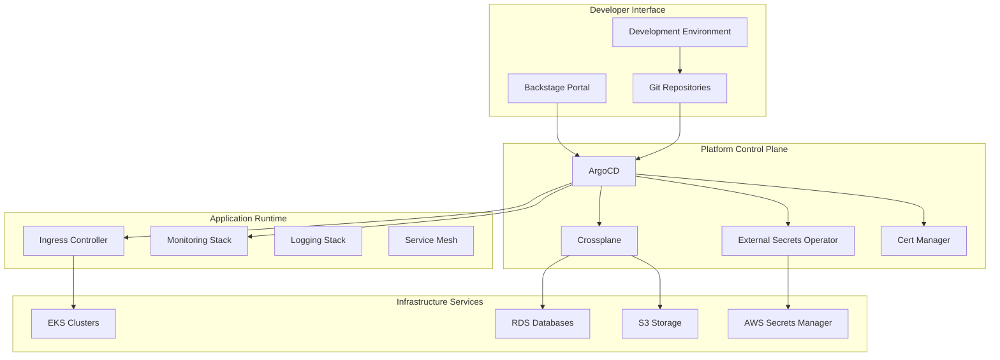

# Platform Engineering on EKS - Platform Architecture Guide

This document provides a comprehensive overview of the platform components and GitOps architecture implemented in the appmod-blueprints repository, focusing on the platform services and application deployment patterns.

## 📚 For Workshop Participants
This guide will help you understand how the platform components work together to support your application development and deployment exercises.

## 🏢 For Platform Adopters  
Use this guide to understand the platform architecture patterns and GitOps workflows that can be implemented in your organization for production use.

## ⚙️ For Infrastructure Engineers
This document provides detailed technical specifications for platform components, GitOps configurations, and customization points for extending the platform.

## 👩‍💻 For Developers
Learn how platform services support your development workflows, from code commit to production deployment through self-service capabilities.

## Table of Contents
- [Overview](#overview)
- [Platform Architecture](#platform-architecture)
- [GitOps Architecture](#gitops-architecture)
- [Platform Components](#platform-components)
- [Application Blueprints](#application-blueprints)
- [Data Flow and Workflows](#data-flow-and-workflows)
- [Security and Compliance](#security-and-compliance)
- [Deployment Scenarios](#deployment-scenarios)

## Overview

The appmod-blueprints repository contains the platform implementation for a complete GitOps-based platform engineering solution. This repository provides the platform services, application templates, and operational patterns that run on the infrastructure established by the platform-engineering-on-eks repository.

## Platform Architecture

### High-Level Platform Components



## GitOps Architecture

### GitOps Repository Structure

The platform implements a multi-repository GitOps pattern:


### GitOps Workflow Pattern


### GitOps Bridge Architecture

The GitOps Bridge is a critical component that connects infrastructure provisioning with ArgoCD-based GitOps deployments. It acts as a data pipeline that passes infrastructure metadata from the bootstrap infrastructure to Kubernetes secrets, which are then consumed by ArgoCD ApplicationSets.


#### How the GitOps Bridge Works

The GitOps Bridge enables infrastructure data to flow seamlessly into GitOps applications:

1. **Infrastructure Metadata Collection**: The bootstrap infrastructure (from platform-engineering-on-eks) collects key information like cluster names, AWS regions, VPC IDs, and service URLs

2. **Bridge Module Processing**: The GitOps Bridge module transforms this metadata into Kubernetes secrets that can be consumed by ArgoCD applications

3. **ApplicationSet Consumption**: ArgoCD ApplicationSets use the cluster secrets to dynamically configure applications across multiple environments

4. **Helm Value Injection**: Infrastructure data is injected into Helm charts as values, enabling environment-specific configurations

#### Key Benefits

- **Decoupling**: GitOps templates don't need to know dynamic infrastructure details
- **Predictability**: Infrastructure data follows consistent patterns and naming conventions
- **Security**: Sensitive data is managed through AWS Secrets Manager and Kubernetes secrets
- **Maintainability**: Changes to infrastructure automatically propagate to applications
- **Scalability**: New environments can be added without modifying GitOps configurations

#### Example: Secret Management Pattern

The platform uses predictable naming conventions for secrets that eliminate the need for dynamic secret name passing:

```
{project_context_prefix}-{service}-{type}-password
```

Examples:
- `peeks-workshop-gitops-keycloak-admin-password`
- `peeks-workshop-gitops-backstage-postgresql-password`

This pattern allows GitOps applications to reference secrets by name without needing dynamic infrastructure data injection.

### Cluster Registration and Discovery

A key architectural pattern in the platform is the automatic cluster registration system. When EKS clusters are created through any infrastructure tool (Terraform, KRO, Crossplane), they automatically register themselves in AWS Secrets Manager with metadata that enables ArgoCD ApplicationSets to discover and configure them dynamically.

#### Cluster Registration Flow


#### Cluster Registration Secret Format

Each cluster creates a standardized registration secret that ApplicationSets use for dynamic configuration:

```json
{
  "cluster_name": "spoke-dev-us-east-1",
  "cluster_endpoint": "https://ABC123.gr7.us-east-1.eks.amazonaws.com",
  "cluster_ca_certificate": "LS0tLS1CRUdJTi...",
  "aws_region": "us-east-1",
  "resource_prefix": "peeks-workshop",
  "environment": "dev",
  "tenant": "platform-team",
  "cluster_type": "spoke",
  "labels": {
    "environment": "dev",
    "region": "us-east-1",
    "cluster-type": "spoke",
    "tenant": "platform-team",
    "resource-prefix": "peeks-workshop",
    "workload-type": "applications"
  },
  "annotations": {
    "addons_repo_basepath": "gitops/addons/",
    "workloads_repo_basepath": "gitops/workloads/",
    "kustomize_path": "environments/dev",
    "helm_values_path": "values/dev.yaml",
    "resource_prefix": "peeks-workshop",
    "sync_wave": "10"
  }
}
```

#### ApplicationSet Integration

ArgoCD ApplicationSets automatically discover clusters and use their metadata for configuration:

```yaml
apiVersion: argoproj.io/v1alpha1
kind: ApplicationSet
metadata:
  name: platform-addons
  namespace: argocd
spec:
  generators:
  - clusters:
      selector:
        matchLabels:
          cluster-type: spoke
      values:
        environment: '{{metadata.labels.environment}}'
        tenant: '{{metadata.labels.tenant}}'
        addons_path: '{{metadata.annotations.addons_repo_basepath}}'
        values_path: '{{metadata.annotations.helm_values_path}}'
  template:
    metadata:
      name: '{{name}}-platform-addons'
    spec:
      project: '{{values.tenant}}'
      source:
        repoURL: https://github.com/aws-samples/appmod-blueprints
        path: '{{values.addons_path}}environments/{{values.environment}}'
        targetRevision: main
        helm:
          valueFiles:
          - '{{values.values_path}}'
      destination:
        server: '{{server}}'
        namespace: kube-system
      syncPolicy:
        automated:
          prune: true
          selfHeal: true
        syncOptions:
        - CreateNamespace=true
```

#### Multi-Tool Support

The platform supports cluster creation through multiple infrastructure tools:

**Terraform Integration:**
```hcl
resource "aws_secretsmanager_secret" "cluster_registration" {
  name = "cluster-registration-${var.cluster_name}"
  
  secret_string = jsonencode({
    cluster_name    = var.cluster_name
    resource_prefix = var.resource_prefix
    environment     = var.environment
    tenant         = var.tenant
    labels = {
      environment      = var.environment
      "cluster-type"   = var.cluster_type
      tenant          = var.tenant
      "resource-prefix" = var.resource_prefix
    }
    annotations = {
      addons_repo_basepath = "gitops/addons/"
      kustomize_path      = "environments/${var.environment}"
      resource_prefix     = var.resource_prefix
    }
  })
}
```

**KRO (Kubernetes Resource Operator):**
```yaml
apiVersion: kro.run/v1alpha1
kind: ResourceGroup
metadata:
  name: eks-with-registration
spec:
  resources:
  - id: cluster-registration
    template:
      apiVersion: secretsmanager.aws.crossplane.io/v1beta1
      kind: Secret
      spec:
        forProvider:
          name: cluster-registration-{{ .spec.clusterName }}
          secretString: |
            {
              "cluster_name": "{{ .spec.clusterName }}",
              "resource_prefix": "{{ .spec.resourcePrefix }}",
              "environment": "{{ .spec.environment }}",
              "labels": {{ .spec.labels | merge(dict "resource-prefix" .spec.resourcePrefix) | toJson }}
            }
```

**Crossplane Composition:**
```yaml
apiVersion: apiextensions.crossplane.io/v1
kind: Composition
metadata:
  name: eks-cluster-with-registration
spec:
  resources:
  - name: cluster-registration-secret
    base:
      apiVersion: secretsmanager.aws.crossplane.io/v1beta1
      kind: Secret
      spec:
        forProvider:
          secretString: |
            {
              "cluster_name": {{ .spec.clusterName | quote }},
              "resource_prefix": {{ .spec.resourcePrefix | quote }},
              "environment": {{ .spec.environment | quote }},
              "labels": {{ .spec.labels | merge(dict "resource-prefix" .spec.resourcePrefix) | toJson }}
            }
```

#### Benefits of Cluster Registration Pattern

1. **Automatic Discovery**: New clusters are immediately available to ArgoCD without manual configuration
2. **Environment Isolation**: Labels enable environment-specific deployment patterns
3. **Multi-Tenant Support**: Tenant-based cluster organization and access control
4. **Tool Flexibility**: Works with any infrastructure tool that can create AWS secrets
5. **GitOps Native**: Seamless integration with ArgoCD ApplicationSets and cluster generators
6. **Configuration Flexibility**: Annotations enable cluster-specific deployment customization
7. **Audit and Compliance**: Full audit trail of cluster registrations in AWS Secrets Manager

## Platform Components

### Platform Component Relationships


### Core Platform Services

#### ArgoCD - GitOps Controller
**Purpose**: Continuous deployment and configuration management
**Configuration**: `gitops/platform/charts/argo-cd/`
**Key Features**:
- Multi-cluster application deployment
- ApplicationSets for environment promotion
- RBAC integration with external identity providers
- Automated sync and drift detection

#### Crossplane - Infrastructure as Code
**Purpose**: Cloud resource provisioning through Kubernetes APIs
**Configuration**: `platform/crossplane/`
**Key Features**:
- AWS resource compositions (RDS, S3, IAM)
- Self-service infrastructure through Kubernetes CRDs
- Policy-driven resource management
- Cost optimization through resource lifecycle management

#### External Secrets Operator - Secret Management
**Purpose**: Secure secret synchronization from AWS Secrets Manager
**Configuration**: Deployed via GitOps addons
**Key Features**:
- AWS Secrets Manager integration
- Automatic secret rotation
- Cross-namespace secret sharing
- Pod Identity authentication

#### Backstage - Developer Portal
**Purpose**: Self-service developer experience platform
**Configuration**: `platform/backstage/`
**Key Features**:
- Application templates and scaffolding
- Service catalog and documentation
- CI/CD pipeline integration
- Infrastructure visibility

## Application Blueprints

### Supported Application Types

The platform includes blueprints for multiple technology stacks:

#### .NET Applications
**Location**: `applications/dotnet/`
**Features**:
- Clean Architecture pattern
- Entity Framework with PostgreSQL
- Health checks and observability
- Container-optimized builds

#### Java Applications  
**Location**: `applications/java/`
**Features**:
- Spring Boot microservices
- JPA with database integration
- Actuator endpoints for monitoring
- Maven-based builds

#### Node.js Applications
**Location**: `applications/node/`
**Features**:
- Express.js framework
- TypeScript support
- npm/yarn package management
- Modern JavaScript patterns

#### Python Applications
**Location**: `applications/python/`
**Features**:
- FastAPI framework
- Async/await patterns
- Poetry dependency management
- Type hints and validation

#### Rust Applications
**Location**: `applications/rust/`
**Features**:
- High-performance web services
- Cargo build system
- Memory safety and performance
- Cloud-native patterns

#### Go Applications
**Location**: `applications/golang/`
**Features**:
- Standard library HTTP server
- Goroutine concurrency
- Module-based dependency management
- Minimal container images

### Application Deployment Pattern


## Data Flow and Workflows

### Developer Workflow


### Infrastructure Provisioning Workflow


## Security and Compliance

### Security Architecture


### Security Best Practices

#### Identity and Access Management
- **Pod Identity**: Eliminates long-lived credentials for AWS service access
- **RBAC**: Fine-grained permissions for Kubernetes resources
- **OIDC Integration**: Centralized authentication through external identity providers
- **Least Privilege**: Minimal permissions for each component and user

#### Secret Management
- **External Secrets**: Centralized secret management through AWS Secrets Manager
- **Automatic Rotation**: Secrets are rotated automatically without application downtime
- **Encryption**: Secrets encrypted at rest and in transit
- **Audit Trail**: All secret access is logged and monitored

#### Network Security
- **VPC Isolation**: Network-level isolation between environments
- **Security Groups**: Application-level firewall rules
- **Network Policies**: Kubernetes-native network segmentation
- **TLS Everywhere**: End-to-end encryption for all communications

## Deployment Scenarios

### Platform-Only Deployment
**Purpose**: Core platform services without workshop-specific components
**Components**:
- ArgoCD for GitOps
- Crossplane for infrastructure provisioning
- External Secrets for secret management
- Ingress controller for traffic routing
- Monitoring and logging stack

**Use Cases**:
- Production platform deployment
- Organizational platform adoption
- Custom application development

### Full Workshop Environment
**Purpose**: Complete learning environment with sample applications
**Additional Components**:
- Backstage developer portal
- Sample applications across multiple technology stacks
- Workshop-specific configurations and examples
- Development tools and utilities

**Use Cases**:
- Training and education
- Platform evaluation
- Proof-of-concept development

### Development Environment
**Purpose**: Minimal setup for individual developers
**Components**:
- Single-cluster deployment
- Essential platform services only
- Local development tools integration
- Simplified networking and security

**Use Cases**:
- Individual developer workstations
- Local testing and development
- Resource-constrained environments

---

## Related Documentation

- **Infrastructure Bootstrap**: See [platform-engineering-on-eks ARCHITECTURE.md](https://gitlab.aws.dev/aws-tfc-containers/containers-hands-on-content/platform-engineering-on-eks/-/blob/main/ARCHITECTURE.md) for infrastructure provisioning details
- **Getting Started**: See [GETTING-STARTED.md](GETTING-STARTED.md) for deployment instructions
- **Deployment Guide**: See [DEPLOYMENT-GUIDE.md](DEPLOYMENT-GUIDE.md) for detailed deployment scenarios
- **Troubleshooting**: See [TROUBLESHOOTING.md](TROUBLESHOOTING.md) for common issues and solutions

This architecture provides a comprehensive foundation for platform engineering that balances developer productivity, operational efficiency, and security requirements.