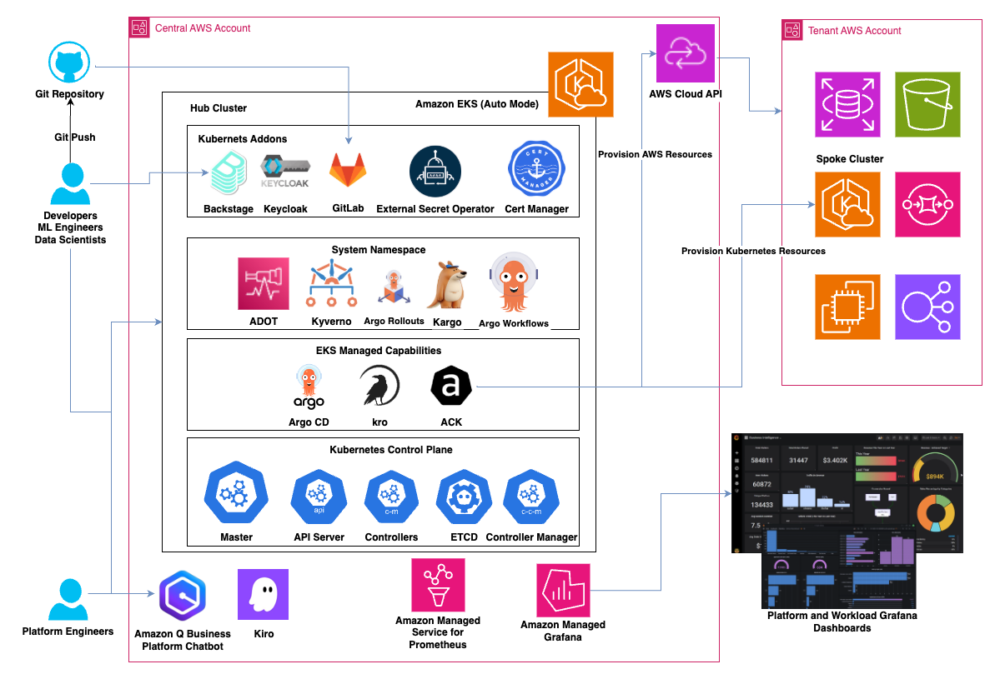

# Platform Engineering on Amazon EKS

A comprehensive platform engineering solution that provides application modernization blueprints, GitOps patterns, and developer self-service capabilities on Amazon EKS.

This code is used in associated Workshop: https://catalog.workshops.aws/platform-engineering-on-eks/en-US

## Overview

This repository implements a complete platform engineering solution on Amazon EKS, enabling organizations to modernize applications and adopt cloud-native practices. It provides a production-ready platform with integrated developer portals, GitOps workflows, and progressive delivery capabilities.

## Architecture




## Getting Started

The easiest way is to use CloudFormation to bootstrap the workshop architecture with an IDE to work from, pre-configured to interact with the platform.

Once you are logged into your AWS Console with the appropriate permissions, you can set up the environment to run the labs in your account. These instructions have been tested in the following AWS region and are not guaranteed to work in others without modification:

- `us-west-2`

The first step is to run the cluster deployment script with the provided CloudFormation template. The easiest way to do this is using AWS CloudShell in the account where you will be running the lab exercises. Open CloudShell with the link below or by following [this documentation](https://docs.aws.amazon.com/cloudshell/latest/userguide/getting-started.html#launch-region-shell):

[Click here to access CloudShell in US-WEST-2](https://console.aws.amazon.com/cloudshell/home?region=us-west-2#)

Once CloudShell has loaded, run the following commands:

### For us-west-2:
```bash
ASSET_URL=https://ws-assets-prod-iad-r-pdx-f3b3f9f1a7d6a3d0.s3.us-west-2.amazonaws.com/daa2a765-04db-4399-aaa7-fddc8d07e9e1/peeks-workshop-team-stack-self.json

curl $ASSET_URL --output peeks-workshop.json
grep '"WORKSHOP_GIT_BRANCH":' static/peeks-workshop-* # should output:  v0.1.2-riv25

bucketName="peeks-workshop-$(uuidgen | tr -d - | tr '[:upper:]' '[:lower:]')"
aws s3api create-bucket \
    --bucket "$bucketName" \
    --region us-west-2 \
    --create-bucket-configuration LocationConstraint=us-west-2

aws cloudformation deploy --stack-name peeks-workshop \
    --template-file ./peeks-workshop.json \
    --parameter-overrides \
        ParticipantAssumedRoleArn=$(aws sts get-caller-identity --query Arn --output text) \
    --capabilities CAPABILITY_NAMED_IAM \
    --s3-bucket $bucketName \
    --disable-rollback
```

### For eu-central-1
```bash
ASSET_URL=https://ws-assets-prod-iad-r-fra-b129423e91500967.s3.eu-central-1.amazonaws.com/daa2a765-04db-4399-aaa7-fddc8d07e9e1/peeks-workshop-team-stack-self.json

curl $ASSET_URL --output peeks-workshop.json
grep '"WORKSHOP_GIT_BRANCH":' static/peeks-workshop-* # should output:  v0.1.2-riv25

bucketName="peeks-workshop-$(uuidgen | tr -d - | tr '[:upper:]' '[:lower:]')"
aws s3api create-bucket \
    --bucket "$bucketName" \
    --region eu-central-1 \
    --create-bucket-configuration LocationConstraint=eu-central-1

aws cloudformation deploy --stack-name peeks-workshop \
    --template-file ./peeks-workshop.json \
    --parameter-overrides \
        ParticipantAssumedRoleArn=$(aws sts get-caller-identity --query Arn --output text) \
    --capabilities CAPABILITY_NAMED_IAM \
    --s3-bucket $bucketName \
    --disable-rollback
```

> If you want support for additional regions you can ask the workshop team for the correct asset URL for your region.

You will then see the following output as your CloudFormation template is being deployed:

```
Waiting for changeset to be created..
Waiting for stack create/update to complete
Successfully created/updated stack - peeks-workshop
```

The CloudFormation stack will take roughly 90 minutes to deploy, and once completed you can retrieve the URL and password for the Visual Code Server IDE with the following command:

```bash
# Get IDE URL
aws cloudformation describe-stacks --stack-name peeks-workshop \
    --query 'Stacks[0].Outputs[?OutputKey==`IdeUrl`].OutputValue' --output text

# Get IDE Password
aws cloudformation describe-stacks --stack-name peeks-workshop \
    --query 'Stacks[0].Outputs[?OutputKey==`IdePassword`].OutputValue' --output text
```

Which will provide an output similar to the following, which you can use to access the IDE in a web browser (we recommend opening a new tab):

Example:
```
https://d1bti1yw27krdm.cloudfront.net/?folder=/home/ec2-user/environment
```

The IDE should already be configured with lots of tools and extensions, and you can start working on the exercises right away.

In addition, the code repositories that we will use in this workshop have been downloaded into the `~/environment/platform-on-eks-workshop/` folder, and the Python prerequisites have been installed.

You can check all the addons deployed using the command:

```bash
argocd-sync
```

The following script will help you connect to the different tools using the SSO mechanism with keycloack:

```bash
./platform-on-eks-workshop/platform/infra/terraform/scripts/1-tools-urls.sh  
```

## Contributing

We welcome contributions to the Modern Engineering on AWS initiative. Please read our [CONTRIBUTING](CONTRIBUTING.md) guide for details on our code of conduct and the process for submitting pull requests.

## Security

See [CONTRIBUTING](CONTRIBUTING.md#security-issue-notifications) for more information on reporting security issues.

## License

This library is licensed under the MIT-0 License. See the LICENSE file for details.

## Contact

For any questions or feedback regarding Platform Engineering on Amazon EKS, please open an issue in this repository.

