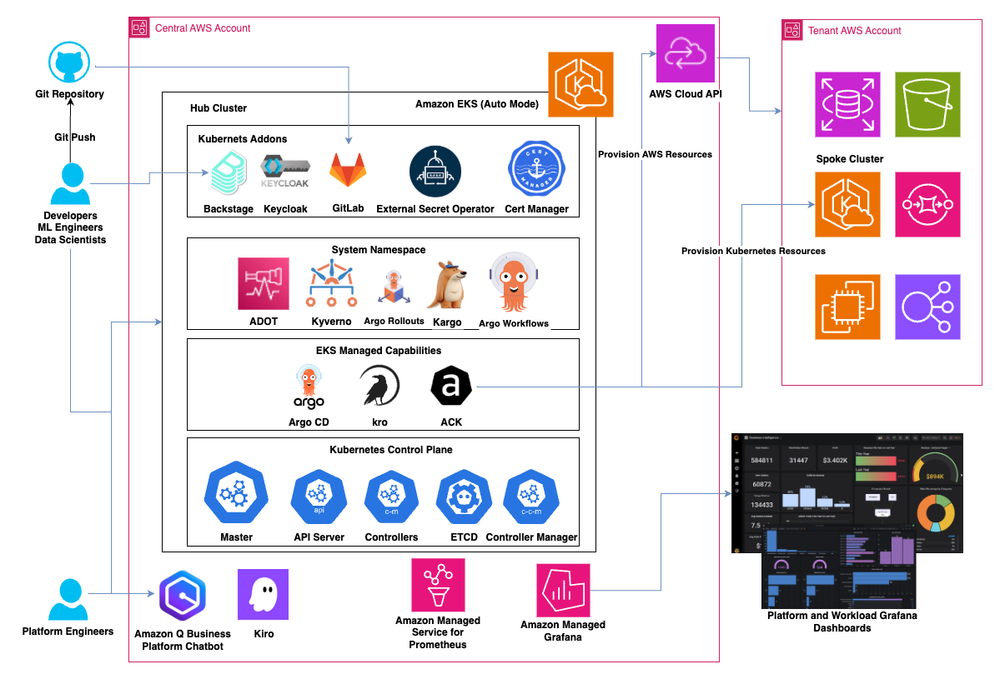
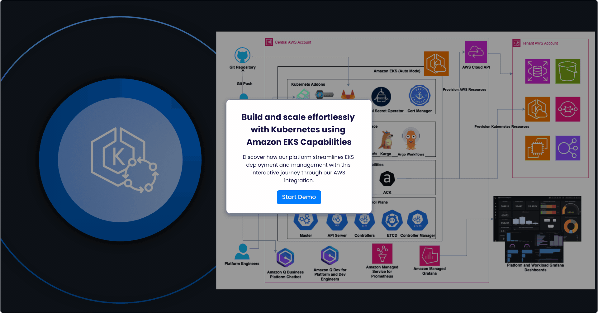

# Platform Engineering on Amazon EKS

A comprehensive platform engineering solution that provides application modernization blueprints, GitOps patterns, and developer self-service capabilities on Amazon EKS.

This code is used in associated Workshop: https://catalog.workshops.aws/platform-engineering-on-eks/en-US

## Overview

This repository implements a complete platform engineering solution on Amazon EKS, enabling organizations to modernize applications and adopt cloud-native practices. It provides a production-ready platform with integrated developer portals, GitOps workflows, and progressive delivery capabilities.

## Architecture



## Clickable Interactive Demo

[](https://app.storylane.io/share/219m06juq81g)

## Getting Started

The easiest way is to use CloudFormation to bootstrap the workshop architecture with an IDE to work from, pre-configured to interact with the platform.

Once you are logged into your AWS Console with the appropriate permissions, you can set up the environment to run the labs in your account. These instructions have been tested in the following AWS region and are not guaranteed to work in others without modification:

- `us-west-2`

The first step is to run the cluster deployment script with the provided CloudFormation template. The easiest way to do this is using AWS CloudShell in the account where you will be running the lab exercises. Open CloudShell with the link below or by following [this documentation](https://docs.aws.amazon.com/cloudshell/latest/userguide/getting-started.html#launch-region-shell):

[Click here to access CloudShell in US-WEST-2](https://console.aws.amazon.com/cloudshell/home?region=us-west-2#)

Once CloudShell has loaded, run the following commands:

### For us-west-2:
```bash
ASSET_URL=https://ws-assets-prod-iad-r-pdx-f3b3f9f1a7d6a3d0.s3.us-west-2.amazonaws.com/daa2a765-04db-4399-aaa7-fddc8d07e9e1/peeks-workshop-team-stack-self.json

curl $ASSET_URL --output peeks-workshop.json
grep '"WORKSHOP_GIT_BRANCH":' peeks-workshop-* # should output:  v0.1.3

bucketName="peeks-workshop-$(uuidgen | tr -d - | tr '[:upper:]' '[:lower:]')"
aws s3api create-bucket \
    --bucket "$bucketName" \
    --region us-west-2 \
    --create-bucket-configuration LocationConstraint=us-west-2

aws cloudformation deploy --stack-name peeks-workshop \
    --template-file ./peeks-workshop.json \
    --parameter-overrides \
        ParticipantAssumedRoleArn=$(aws sts get-caller-identity --query Arn --output text) \
    --capabilities CAPABILITY_NAMED_IAM \
    --s3-bucket $bucketName \
    --disable-rollback
```

### For eu-central-1
```bash
ASSET_URL=https://ws-assets-prod-iad-r-fra-b129423e91500967.s3.eu-central-1.amazonaws.com/daa2a765-04db-4399-aaa7-fddc8d07e9e1/peeks-workshop-team-stack-self.json

curl $ASSET_URL --output peeks-workshop.json
grep '"WORKSHOP_GIT_BRANCH":' peeks-workshop-* # should output:  v0.1.3

bucketName="peeks-workshop-$(uuidgen | tr -d - | tr '[:upper:]' '[:lower:]')"
aws s3api create-bucket \
    --bucket "$bucketName" \
    --region eu-central-1 \
    --create-bucket-configuration LocationConstraint=eu-central-1

aws cloudformation deploy --stack-name peeks-workshop \
    --template-file ./peeks-workshop.json \
    --parameter-overrides \
        ParticipantAssumedRoleArn=$(aws sts get-caller-identity --query Arn --output text) \
    --capabilities CAPABILITY_NAMED_IAM \
    --s3-bucket $bucketName \
    --disable-rollback
```

> If you want support for additional regions you can ask the workshop team for the correct asset URL for your region.

You will then see the following output as your CloudFormation template is being deployed:

```
Waiting for changeset to be created..
Waiting for stack create/update to complete
Successfully created/updated stack - peeks-workshop
```

The CloudFormation stack will take roughly 90 minutes to deploy, and once completed you can retrieve the URL and password for the Visual Code Server IDE with the following command:

```bash
# Get IDE URL
aws cloudformation describe-stacks --stack-name peeks-workshop \
    --query 'Stacks[0].Outputs[?OutputKey==`IdeUrl`].OutputValue' --output text

# Get IDE Password
aws cloudformation describe-stacks --stack-name peeks-workshop \
    --query 'Stacks[0].Outputs[?OutputKey==`IdePassword`].OutputValue' --output text
```

Which will provide an output similar to the following, which you can use to access the IDE in a web browser (we recommend opening a new tab):

Example:
```
https://d1bti1yw27krdm.cloudfront.net/?folder=/home/ec2-user/environment
```

The IDE should already be configured with lots of tools and extensions, and you can start working on the exercises right away.

In addition, the code repositories that we will use in this workshop have been downloaded into the `~/environment/platform-on-eks-workshop/` folder, and the Python prerequisites have been installed.

You can check all the addons deployed using the command:

```bash
argocd-sync
```

The platform URLs and credentials are exported as environment variables in `~/.bashrc.d/platform.sh` on the IDE instance. Run `source ~/.bashrc.d/platform.sh` to reload them.

## GitOps Platform

The `gitops/` directory contains a complete GitOps-based addon management system using ArgoCD ApplicationSets, Helm charts, and Crossplane. See [gitops/README.md](gitops/README.md) for architecture, quick start, and operations guide.

## Regenerating config.local.yaml

When deployed via CloudFormation, `config.local.yaml` is generated automatically
during IDE bootstrap. If you need to (re)create it manually — for example on a
self-managed environment or to recover from a corrupted file — use the standalone
helper:

```bash
# Idempotent: skips if a valid config.local.yaml already exists
workshop/create-config.sh

# Force overwrite
FORCE=true workshop/create-config.sh

# Override the branch (e.g. when WORKSHOP_GIT_BRANCH points to a release tag)
REPO_REVISION=... workshop/create-config.sh
```

This is a standalone script (not a Taskfile task) because every task reads
`config.local.yaml` at parse time, so a task cannot create the file when it does
not yet exist. It auto-detects the AWS account, region, IAM Identity Center
instance/group, and admin role name, and writes a CloudFront-mode config
(`domain: ""`).

## APEX Skills

The `peeks` Kiro agent that ships in every participant IDE bundles a curated
subset of the [APEX skills](https://github.com/aws-samples/sample-apex-skills)
(Amazon-authored EKS agent skills) so they are available **by default** — no
manual install step.

### What's included

Vendored under `hack/.kiro/skills/` alongside the PEEKS-authored skills
(`troubleshoot-kro`, `troubleshoot-platform`, `manage-addons`):

| APEX skill | Purpose |
| ---------- | ------- |
| `eks-recon` | Discover and inventory an existing EKS environment |
| `eks-platform-engineering` | Platform/IDP patterns on EKS |
| `eks-best-practices` | EKS best-practice guidance (Auto Mode, Karpenter, networking, cost…) |
| `eks-security` | EKS security review guidance |
| `eks-upgrade-check` | Pre-upgrade readiness checks |
| `eks-cost-intelligence` | Cost analysis and optimization |

The exact pinned version (tag + commit SHA) is recorded in
`hack/.kiro/skills/APEX_VERSION`.

### How they reach the agent

The `peeks` agent (`hack/.kiro/agents/peeks.json`) declares a knowledge-base
resource over `file://.kiro/skills` with `include: ["**/SKILL.md"]`. Every
vendored APEX skill has a top-level `SKILL.md`, so it is indexed automatically —
no change to `peeks.json` is required. During Workshop Studio provisioning the
SetupIDE step copies `hack/.kiro/` into `~/.kiro/`, so the skills land in
`~/.kiro/skills/` on each IDE and the agent inherits them (default resource
inheritance is left enabled in `hack/.kiro/settings/cli.json`).

### Vendoring approach: pinned and deterministic

APEX skills are **vendored** — the skill files are checked into this repo under
`hack/.kiro/skills/` at a **pinned tag**, rather than fetched from the network
when a workshop IDE boots. This is a deliberate choice for a workshop that is
provisioned and re-installed repeatedly.

How it works, end to end:

1. **Pin.** `scripts/sync-apex-skills.sh` declares the exact upstream release in
   one place: `APEX_REF="v1.2.0"` (a tag, never a floating branch like `main`).
2. **Vendor.** The script clones that tag, copies only the 6 EKS skills into
   `hack/.kiro/skills/`, and writes the resolved tag **and commit SHA** to
   `hack/.kiro/skills/APEX_VERSION`. The skill files then live in Git and are
   reviewed in a PR like any other change.
3. **Ship.** During Workshop Studio provisioning, the SetupIDE step copies
   `hack/.kiro/` into `~/.kiro/` on each IDE, so the skills are present at
   `~/.kiro/skills/` before the participant opens a shell — no download, no
   network call, no per-IDE variation.
4. **Index.** The `peeks` agent picks them up automatically through its existing
   `file://.kiro/skills` (`**/SKILL.md`) resource (see "How they reach the
   agent" above).

Because the bytes are frozen in Git, every IDE in every event gets **exactly**
the same skills — reproducible and auditable, with zero boot-time dependency on
GitHub availability or rate limits.

### How to update the vendored skills

Updating is a maintainer task done in a dev/CI checkout, reviewed via PR — never
edited by hand on an IDE:

1. Find the new stable APEX tag you want (e.g. on the
   [releases page](https://github.com/aws-samples/sample-apex-skills/releases)).
2. Edit `scripts/sync-apex-skills.sh` and bump the pin:
   ```bash
   APEX_REF="v1.3.0"   # was v1.2.0
   ```
   (If the set of skills to ship changes, also edit the `APEX_SKILLS` array in
   the same file.)
3. Re-run the script from the repo root:
   ```bash
   scripts/sync-apex-skills.sh
   ```
4. Review the diff and the updated `hack/.kiro/skills/APEX_VERSION` (tag + SHA),
   then commit and open a PR.

The script is safe to re-run:

- **Idempotent** — re-running with the same `APEX_REF` produces byte-identical
  output (no spurious diff).
- **Non-destructive** — it only manages the vendored `eks-*` skills; it never
  touches the PEEKS-authored skills (`troubleshoot-kro`, `troubleshoot-platform`,
  `manage-addons`) and aborts if an APEX skill name would collide with one.
- **Fails cleanly** — if the pinned tag doesn't exist or the network is
  unavailable, it exits with a clear error and leaves the vendored skills
  unchanged (it verifies every requested skill is present upstream *before*
  modifying anything).

To refresh an **already-provisioned** IDE without a full re-provision, re-copy
the vendored skills into the running IDE's Kiro home:

```bash
cp -r hack/.kiro/skills/eks-* ~/.kiro/skills/
```

### Alternative (documented, NOT enabled): clone-at-startup

Instead of vendoring, a run-once shell hook could fetch the skills on the first
interactive shell of each IDE — e.g. a `hack/.bashrc.d/` script guarded by a
marker file (`~/.apex-skills-installed`) that performs a pinned `git clone`
(or `npx apex-skills`) into `~/.kiro/skills/` once.

Trade-offs:

- **Pro:** skills stay closer to the latest upstream without a repo refresh.
- **Con:** adds a network dependency at boot, makes each IDE non-deterministic
  (a participant hits a silent failure if GitHub is throttled or blocked), and
  slows first-shell startup.

For a workshop that must be reproducible and re-installable in a loop, the
pinned vendoring above is the default. The clone-at-startup option is documented
here only as an alternative and is intentionally **not** wired in.

## Contributing

We welcome contributions to the Modern Engineering on AWS initiative. Please read our [CONTRIBUTING](CONTRIBUTING.md) guide for details on our code of conduct and the process for submitting pull requests.

## Security

See [CONTRIBUTING](CONTRIBUTING.md#security-issue-notifications) for more information on reporting security issues.

## License

This library is licensed under the MIT-0 License. See the LICENSE file for details.

## Contact

For any questions or feedback regarding Platform Engineering on Amazon EKS, please open an issue in this repository.

