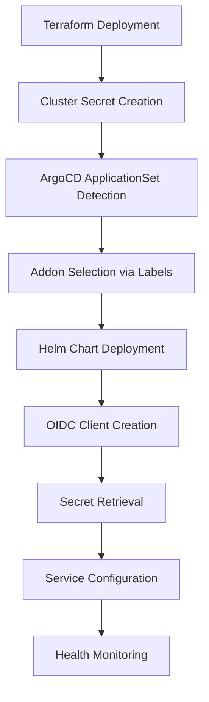
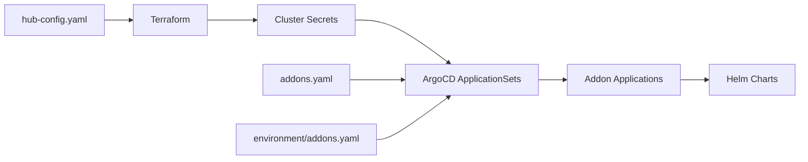

# AppMod Blueprints - Platform Architecture

## GitOps Addon Management System

### Overview

The platform uses a sophisticated GitOps-based addon management system that provides declarative configuration, automated deployment, and multi-cluster orchestration for platform services. This modern approach eliminates the need for manual bootstrap scripts by leveraging ArgoCD ApplicationSets, cluster-specific configurations, and automated secret management through External Secrets Operator.

### Architecture Components

The GitOps addon management system consists of three main configuration layers:

1. **Addon Definitions** (`gitops/addons/bootstrap/default/addons.yaml`) - Central registry of all available platform addons
2. **Environment Configuration** (`gitops/addons/environments/control-plane/addons.yaml`) - Environment-specific addon enablement
3. **Cluster Configuration** (`platform/infra/terraform/hub-config.yaml`) - Per-cluster addon activation via labels

### Addon Definition Structure

Each addon in `addons.yaml` follows a standardized configuration pattern:

```yaml
addon-name:
  enabled: false                          # Default state (disabled)
  annotationsAppSet:
    argocd.argoproj.io/sync-wave: '3'    # Deployment order
  namespace: addon-namespace              # Target Kubernetes namespace
  chartName: helm-chart-name             # Helm chart name
  chartRepository: https://helm-repo-url  # Helm repository URL
  defaultVersion: 'chart-version'        # Default chart version
  selector:
    matchExpressions:
      - key: enable_addon_name            # Cluster label selector
        operator: In
        values: ['true']
  valuesObject:                          # Helm values configuration
    global:
      resourcePrefix: '{{.metadata.annotations.resource_prefix}}'
      ingress_domain_name: '{{.metadata.annotations.ingress_domain_name}}'
    # Addon-specific configuration
```

### Cluster Secret Annotations

ArgoCD ApplicationSets use cluster secrets with annotations to template addon configurations:

**Key Annotations:**
- `{{.metadata.annotations.resource_prefix}}` - Resource naming prefix (e.g., "peeks")
- `{{.metadata.annotations.ingress_domain_name}}` - Platform domain name
- `{{.metadata.annotations.aws_region}}` - AWS region
- `{{.metadata.annotations.aws_cluster_name}}` - EKS cluster name
- `{{.metadata.annotations.addons_repo_basepath}}` - GitOps repository base path

**Key Labels:**
- `{{.metadata.labels.environment}}` - Environment (control-plane, dev, prod)
- `{{.metadata.labels.tenant}}` - Tenant identifier
- `enable_addon_name: "true"` - Individual addon enablement flags

### How Addons Are Defined, Configured, and Deployed

The GitOps addon management system operates through a sophisticated multi-layer configuration approach:

#### 1. Addon Definition Layer (`gitops/addons/bootstrap/default/addons.yaml`)

This is the central registry where all platform addons are defined with their configuration templates:

```yaml
jupyterhub:
  enabled: false                          # Default disabled state
  annotationsAppSet:
    argocd.argoproj.io/sync-wave: '5'    # Deploy after Keycloak (wave 3)
  namespace: jupyterhub                   # Target namespace
  chartName: jupyterhub                   # Helm chart name
  chartRepository: https://hub.jupyter.org/helm-chart/
  defaultVersion: '3.3.7'               # Chart version
  selector:
    matchExpressions:
      - key: enable_jupyterhub            # Cluster label selector
        operator: In
        values: ['true']
  valuesObject:                          # Helm values template
    global:
      resourcePrefix: '{{.metadata.annotations.resource_prefix}}'
      ingress_domain_name: '{{.metadata.annotations.ingress_domain_name}}'
    hub:
      config:
        GenericOAuthenticator:
          client_id: jupyterhub
          oauth_callback_url: https://{{.metadata.annotations.ingress_domain_name}}/jupyterhub/hub/oauth_callback
```

#### 2. Environment Enablement Layer (`gitops/addons/environments/control-plane/addons.yaml`)

Environment-specific addon activation:

```yaml
jupyterhub:
  enabled: true    # Enables ApplicationSet generation for this environment
kubeflow:
  enabled: true
mlflow:
  enabled: true
```

#### 3. Cluster Configuration Layer (`platform/infra/terraform/hub-config.yaml`)

Per-cluster addon activation via Terraform:

```yaml
clusters:
  hub:
    addons:
      enable_jupyterhub: true     # Creates cluster label for addon selection
      enable_kubeflow: true
      enable_mlflow: true
```

#### 4. Secret Management Integration

Addons requiring authentication integrate with Keycloak and External Secrets:

**Keycloak OIDC Client Creation**:
```yaml
# Automatic client creation via keycloak-config job
{
  "clientId": "jupyterhub",
  "protocol": "openid-connect",
  "redirectUris": ["https://{{domain}}/jupyterhub/hub/oauth_callback"],
  "webOrigins": ["/*"]
}
```

**External Secrets Configuration**:
```yaml
# Client secrets retrieved from AWS Secrets Manager
apiVersion: external-secrets.io/v1
kind: ExternalSecret
metadata:
  name: jupyterhub-oidc-secret
spec:
  secretStoreRef:
    name: aws-secrets-manager
  data:
    - secretKey: CLIENT_SECRET
      remoteRef:
        key: '{{cluster_name}}/secrets'
        property: jupyterhub_client_secret
```

### Deployment Flow

The GitOps addon deployment follows this automated sequence:



1. **Terraform Infrastructure**: Creates EKS cluster and registers it with ArgoCD
2. **Cluster Secret**: Contains metadata annotations and addon enablement labels
3. **ApplicationSet Processing**: ArgoCD detects cluster and generates Applications
4. **Addon Deployment**: Helm charts deployed based on cluster labels and sync waves
5. **OIDC Integration**: Keycloak automatically creates required OIDC clients
6. **Secret Management**: External Secrets Operator retrieves client secrets from AWS Secrets Manager
7. **Configuration Templating**: Cluster annotations populate addon configurations
8. **Health Validation**: ArgoCD monitors addon health and sync status

### Sync Wave Orchestration

Addons use ArgoCD sync waves to ensure proper deployment ordering:

- **Wave -5**: Multi-account setup and foundational resources
- **Wave -3**: Kro (Kubernetes Resource Orchestrator)
- **Wave -2**: Kro manifests and resource definitions
- **Wave -1**: AWS Controllers for Kubernetes (ACK)
- **Wave 0**: Core infrastructure (ArgoCD, metrics-server, ingress classes)
- **Wave 1**: Ingress controllers and networking
- **Wave 2**: Certificate management and GitLab
- **Wave 3**: Identity management (Keycloak) and monitoring
- **Wave 4**: Policy enforcement and reporting
- **Wave 5**: Application deployment tools
- **Wave 6**: Developer tools requiring authentication (Backstage, Argo Workflows)

### SSO Integration Pattern

Platform addons integrate with Keycloak for centralized authentication:

```yaml
# Example: ArgoCD OIDC Configuration
argocd:
  valuesObject:
    configs:
      cm:
        url: https://{{.metadata.annotations.ingress_domain_name}}/argocd
        oidc.config: |
          name: Keycloak
          issuer: https://{{.metadata.annotations.ingress_domain_name}}/keycloak/realms/platform
          clientID: argocd
          enablePKCEAuthentication: true
          requestedScopes: ["openid", "profile", "email", "groups"]
```

### External Secrets Integration

Addons use External Secrets Operator for secure credential management:

```yaml
# Example: External Secret for OIDC Client
- apiVersion: external-secrets.io/v1
  kind: ExternalSecret
  metadata:
    name: addon-oidc-secret
  spec:
    secretStoreRef:
      name: aws-secrets-manager
      kind: ClusterSecretStore
    target:
      name: addon-credentials
    data:
      - secretKey: CLIENT_SECRET
        remoteRef:
          key: '{{.metadata.annotations.aws_cluster_name}}/secrets'
          property: addon_client_secret
```

## Step-by-Step Guide: Adding New Addons to the Platform

### Prerequisites

Before adding a new addon, ensure you have:
- Access to the GitOps repository with write permissions
- Understanding of the addon's Helm chart requirements and dependencies
- Knowledge of the addon's SSO integration requirements
- Familiarity with ArgoCD sync waves and deployment ordering
- Understanding of External Secrets Operator for credential management

### Step 1: Define the Addon in addons.yaml

Add your addon definition to `gitops/addons/bootstrap/default/addons.yaml`:

```yaml
my-new-addon:
  enabled: false                          # Always start disabled
  annotationsAppSet:
    argocd.argoproj.io/sync-wave: '3'    # Choose appropriate sync wave
  namespace: my-addon-namespace           # Target namespace
  chartName: my-addon-chart              # Helm chart name
  chartRepository: https://my-helm-repo   # Helm repository URL
  defaultVersion: '1.0.0'               # Chart version
  selector:
    matchExpressions:
      - key: enable_my_new_addon         # Cluster label selector
        operator: In
        values: ['true']
  valuesObject:
    global:
      resourcePrefix: '{{.metadata.annotations.resource_prefix}}'
      ingress_domain_name: '{{.metadata.annotations.ingress_domain_name}}'
    # Add addon-specific configuration here
    service:
      type: ClusterIP
    ingress:
      enabled: true
      host: '{{.metadata.annotations.ingress_domain_name}}'
      path: /my-addon
```

### Step 2: Create Custom Helm Chart (if needed)

If the addon requires custom configuration or doesn't have a suitable public Helm chart:

1. **Create chart directory**: `gitops/addons/charts/my-new-addon/`
2. **Add Chart.yaml**:
   ```yaml
   apiVersion: v2
   name: my-new-addon
   description: Custom chart for My New Addon
   version: 0.1.0
   dependencies:
     - name: upstream-chart
       version: "1.0.0"
       repository: https://upstream-helm-repo
   ```
3. **Create values.yaml** with default configurations
4. **Add templates/** directory with any custom Kubernetes manifests
5. **Run helm dependency build** if using chart dependencies

### Step 3: Configure Environment Enablement

Enable the addon in the appropriate environment file:

**For control-plane environment** (`gitops/addons/environments/control-plane/addons.yaml`):
```yaml
my-new-addon:
  enabled: true
```

**For other environments**, create or update the respective environment files.

### Step 4: Update Cluster Configuration

Add the addon enablement flag to cluster configurations in `platform/infra/terraform/hub-config.yaml`:

```yaml
clusters:
  hub:
    addons:
      enable_my_new_addon: true
      # ... other addon flags
  spoke1:
    addons:
      enable_my_new_addon: false  # Enable per environment as needed
```

### Step 5: Configure SSO Integration (if applicable)

If your addon requires Keycloak SSO integration, follow this comprehensive setup:

#### 5.1 Add OIDC Client Configuration to Keycloak

Create the client payload file in the Keycloak ConfigMap:

```json
// Add to keycloak-config ConfigMap
{
  "protocol": "openid-connect",
  "clientId": "my-new-addon",
  "name": "My New Addon",
  "description": "Used for My New Addon SSO",
  "publicClient": false,
  "standardFlowEnabled": true,
  "directAccessGrantsEnabled": true,
  "rootUrl": "https://{{domain}}/my-addon",
  "redirectUris": [
    "https://{{domain}}/my-addon/oauth2/callback",
    "https://{{domain}}/my-addon/auth/callback"
  ],
  "webOrigins": ["/*"]
}
```

#### 5.2 Update Keycloak Configuration Job

Add client creation logic to the keycloak-config job script:

```bash
# Add to keycloak config job
create_oidc_client "my-new-addon" "/tmp/my-new-addon-client-payload.json"
```

#### 5.3 Configure External Secrets for Client Credentials

Add the client secret to External Secrets configuration:

```yaml
# Add to External Secrets template
- secretKey: MY_NEW_ADDON_CLIENT_SECRET
  remoteRef:
    key: '{{.metadata.annotations.aws_cluster_name}}/secrets'
    property: my_new_addon_client_secret
```

#### 5.4 Update Addon Values for OIDC Integration

Configure the addon to use OIDC authentication:

```yaml
my-new-addon:
  valuesObject:
    auth:
      oidc:
        enabled: true
        issuerUrl: https://{{.metadata.annotations.ingress_domain_name}}/keycloak/realms/platform
        clientId: my-new-addon
        clientSecret:
          secretName: keycloak-clients
          secretKey: MY_NEW_ADDON_CLIENT_SECRET
        redirectUrl: https://{{.metadata.annotations.ingress_domain_name}}/my-addon/oauth2/callback
        scopes: ["openid", "profile", "email", "groups"]
```

### Step 6: Handle Dependencies and Sync Waves

Choose the appropriate sync wave based on dependencies:

- **Wave -5 to -1**: Infrastructure and foundational services
- **Wave 0-2**: Core platform services
- **Wave 3**: Services requiring Keycloak (after Keycloak deploys)
- **Wave 4+**: Application-level services

Update the `annotationsAppSet.argocd.argoproj.io/sync-wave` value accordingly.

### Step 7: Add Ignore Differences (if needed)

For addons with resources that change frequently or have known drift:

```yaml
my-new-addon:
  ignoreDifferences:
    - group: apps
      kind: Deployment
      jsonPointers:
        - /metadata/managedFields
        - /status
    - group: external-secrets.io
      kind: ExternalSecret
      jsonPointers:
        - /status
        - /metadata/generation
```

### Step 8: Deploy and Validate

1. **Commit changes** to the GitOps repository
2. **Apply Terraform changes** (if hub-config.yaml was modified):
   ```bash
   cd platform/infra/terraform/hub
   ./deploy.sh
   ```
3. **Monitor ArgoCD** for ApplicationSet generation and Application sync
4. **Verify addon deployment**:
   ```bash
   kubectl get applications -n argocd | grep my-new-addon
   kubectl get pods -n my-addon-namespace
   ```
5. **Test functionality** including SSO integration if configured

### Step 9: Documentation and Maintenance

1. **Update platform documentation** with addon-specific information
2. **Add monitoring and alerting** if required
3. **Create runbooks** for common operational tasks
4. **Plan upgrade procedures** for future chart version updates

### Common Patterns and Best Practices

#### Resource Naming Convention
Use the resource prefix for consistent naming:
```yaml
valuesObject:
  nameOverride: '{{.metadata.annotations.resource_prefix}}-my-addon'
  fullnameOverride: '{{.metadata.annotations.resource_prefix}}-my-addon'
```

#### Ingress Configuration
Follow the platform ingress pattern:
```yaml
valuesObject:
  ingress:
    enabled: true
    className: nginx
    annotations:
      nginx.ingress.kubernetes.io/rewrite-target: /$2
    hosts:
      - host: '{{.metadata.annotations.ingress_domain_name}}'
        paths:
          - path: /my-addon(/|$)(.*)
            pathType: ImplementationSpecific
```

#### Service Account and RBAC
Use consistent service account naming:
```yaml
valuesObject:
  serviceAccount:
    create: true
    name: '{{.metadata.annotations.resource_prefix}}-my-addon-sa'
    annotations:
      eks.amazonaws.com/role-arn: '{{.metadata.annotations.my_addon_iam_role_arn}}'
```

#### Health Checks and Monitoring
Configure appropriate health checks:
```yaml
valuesObject:
  livenessProbe:
    httpGet:
      path: /health
      port: http
    initialDelaySeconds: 30
  readinessProbe:
    httpGet:
      path: /ready
      port: http
    initialDelaySeconds: 5
```

### Troubleshooting Common Issues

#### ApplicationSet Not Generating Applications
- Verify cluster secret has the correct `enable_addon_name: "true"` label
- Check selector matchExpressions in addon definition
- Ensure environment addon enablement is set to `enabled: true`

#### Addon Stuck in Sync
- Check sync wave dependencies and ordering
- Verify Helm chart repository accessibility
- Review ArgoCD Application events and logs

#### SSO Integration Failures
- Confirm Keycloak OIDC client exists and is properly configured
- Verify External Secrets are retrieving client credentials
- Check redirect URLs and issuer configuration

#### Resource Conflicts
- Ensure unique namespaces and resource names
- Check for conflicting ingress paths or service ports
- Review RBAC permissions and service account configurations

This comprehensive guide ensures consistent, reliable addon integration following established platform patterns and best practices.

### ML/AI Addons Integration Examples

The platform supports advanced ML/AI addons that follow the same GitOps patterns with enhanced SSO integration:

#### JupyterHub Integration Example

**Addon Definition** (`gitops/addons/bootstrap/default/addons.yaml`):
```yaml
jupyterhub:
  enabled: false
  annotationsAppSet:
    argocd.argoproj.io/sync-wave: '5'    # After Keycloak
  namespace: jupyterhub
  chartName: jupyterhub
  chartRepository: https://hub.jupyter.org/helm-chart/
  defaultVersion: '3.3.7'
  selector:
    matchExpressions:
      - key: enable_jupyterhub
        operator: In
        values: ['true']
  valuesObject:
    global:
      resourcePrefix: '{{.metadata.annotations.resource_prefix}}'
      ingress_domain_name: '{{.metadata.annotations.ingress_domain_name}}'
    hub:
      config:
        GenericOAuthenticator:
          client_id: jupyterhub
          client_secret: # Retrieved via External Secrets
          oauth_callback_url: https://{{.metadata.annotations.ingress_domain_name}}/jupyterhub/hub/oauth_callback
          authorize_url: https://{{.metadata.annotations.ingress_domain_name}}/keycloak/realms/platform/protocol/openid-connect/auth
          token_url: https://{{.metadata.annotations.ingress_domain_name}}/keycloak/realms/platform/protocol/openid-connect/token
          userdata_url: https://{{.metadata.annotations.ingress_domain_name}}/keycloak/realms/platform/protocol/openid-connect/userinfo
```

**Environment Enablement** (`gitops/addons/environments/control-plane/addons.yaml`):
```yaml
jupyterhub:
  enabled: true
```

**Cluster Configuration** (`platform/infra/terraform/hub-config.yaml`):
```yaml
clusters:
  hub:
    addons:
      enable_jupyterhub: true
```

**Keycloak OIDC Client** (automatically created):
```json
{
  "clientId": "jupyterhub",
  "protocol": "openid-connect",
  "redirectUris": ["https://{{domain}}/jupyterhub/hub/oauth_callback"],
  "webOrigins": ["/*"]
}
```

#### Kubeflow Integration Example

**Custom Helm Chart** (`gitops/addons/charts/kubeflow/`):
```yaml
# Chart.yaml
apiVersion: v2
name: kubeflow
description: Kubeflow ML Platform
version: 0.1.0

# values.yaml
global:
  domain: ""
  resourcePrefix: ""

kubeflow:
  centralDashboard:
    oidc:
      issuer: ""
      clientId: "kubeflow"
      clientSecret: ""
```

**Addon Definition**:
```yaml
kubeflow:
  enabled: false
  annotationsAppSet:
    argocd.argoproj.io/sync-wave: '5'
  namespace: kubeflow
  chartName: kubeflow
  chartPath: gitops/addons/charts/kubeflow  # Custom chart path
  selector:
    matchExpressions:
      - key: enable_kubeflow
        operator: In
        values: ['true']
  valuesObject:
    global:
      domain: '{{.metadata.annotations.ingress_domain_name}}'
      resourcePrefix: '{{.metadata.annotations.resource_prefix}}'
    kubeflow:
      centralDashboard:
        oidc:
          issuer: https://{{.metadata.annotations.ingress_domain_name}}/keycloak/realms/platform
          clientId: kubeflow
          clientSecret: # Retrieved via External Secrets
```

### Advanced Configuration Patterns

#### Multi-Environment Addon Management

Different environments can have different addon configurations:

```yaml
# gitops/addons/environments/development/addons.yaml
jupyterhub:
  enabled: true
kubeflow:
  enabled: false  # Disabled in development

# gitops/addons/environments/production/addons.yaml
jupyterhub:
  enabled: true
kubeflow:
  enabled: true   # Enabled in production
mlflow:
  enabled: true
```

#### Conditional Addon Deployment

Use cluster labels for fine-grained control:

```yaml
# Hub cluster - full ML/AI stack
clusters:
  hub:
    addons:
      enable_jupyterhub: true
      enable_kubeflow: true
      enable_mlflow: true
      enable_spark_operator: true
      enable_airflow: true

# Spoke cluster - limited addons
clusters:
  spoke-dev:
    addons:
      enable_jupyterhub: true
      enable_kubeflow: false  # Too resource intensive for dev
```

#### Resource Management for ML/AI Addons

Configure appropriate resource limits:

```yaml
jupyterhub:
  valuesObject:
    hub:
      resources:
        requests:
          cpu: 200m
          memory: 512Mi
        limits:
          cpu: 2
          memory: 2Gi
    singleuser:
      defaultUrl: "/lab"
      memory:
        limit: 2G
        guarantee: 1G
      cpu:
        limit: 2
        guarantee: 0.5
```

This advanced configuration approach ensures ML/AI addons integrate seamlessly with the platform's GitOps architecture while providing the flexibility needed for different environments and use cases.

## Configuration Relationship: hub-config.yaml, addons.yaml, and Cluster Secrets

### Configuration Flow Overview

The platform uses a three-tier configuration system that flows from high-level cluster definitions to runtime ArgoCD templating:



### 1. hub-config.yaml (Source of Truth)

**Location**: `platform/infra/terraform/hub-config.yaml`

**Purpose**: Defines cluster configurations and addon enablement flags

**Structure**:
```yaml
clusters:
  hub:
    name: hub
    region: us-west-2
    environment: control-plane
    tenant: control-plane
    addons:
      enable_argocd: true
      enable_keycloak: true
      enable_backstage: true
      # ... other addon flags
```

**Key Responsibilities**:
- Cluster metadata (name, region, environment, tenant)
- Addon enablement per cluster (`enable_addon_name: true/false`)
- Infrastructure-level configuration
- Multi-cluster orchestration settings

### 2. Terraform Processing

**Process**: Terraform reads `hub-config.yaml` and creates Kubernetes cluster secrets

**Transformation**:
```hcl
# In Terraform locals.tf
locals {
  addons_metadata = merge(
    var.addons_metadata,
    {
      resource_prefix = var.resource_prefix
      ingress_domain_name = local.ingress_domain_name
      aws_region = var.region
      aws_cluster_name = local.cluster_info.cluster_name
      # ... other metadata
    }
  )
}

# Creates cluster secret with annotations and labels
resource "kubernetes_secret" "cluster_secret" {
  metadata {
    name      = "${var.resource_prefix}-${var.cluster_name}-cluster"
    namespace = "argocd"
    
    annotations = local.addons_metadata
    
    labels = merge(
      var.cluster_config.addons,  # enable_addon_name flags
      {
        environment = var.cluster_config.environment
        tenant      = var.cluster_config.tenant
        # ... other labels
      }
    )
  }
}
```

### 3. Cluster Secrets (Runtime Configuration)

**Location**: Kubernetes secrets in `argocd` namespace

**Purpose**: Provide runtime configuration data to ArgoCD ApplicationSets

**Structure**:
```yaml
apiVersion: v1
kind: Secret
metadata:
  name: peeks-hub-cluster
  namespace: argocd
  annotations:
    resource_prefix: "peeks"
    ingress_domain_name: "example.com"
    aws_region: "us-west-2"
    aws_cluster_name: "peeks-hub"
    addons_repo_basepath: "gitops/addons/"
    # ... other metadata
  labels:
    environment: "control-plane"
    tenant: "control-plane"
    enable_argocd: "true"
    enable_keycloak: "true"
    enable_backstage: "true"
    # ... other addon flags
type: Opaque
```

**Key Components**:
- **Annotations**: Metadata for templating addon configurations
- **Labels**: Addon enablement flags and cluster classification
- **Data**: Cluster connection information (kubeconfig, server URL)

### 4. addons.yaml (Addon Definitions)

**Location**: `gitops/addons/bootstrap/default/addons.yaml`

**Purpose**: Central registry of all available platform addons

**Relationship to Cluster Secrets**:
```yaml
argocd:
  enabled: false  # Default state
  selector:
    matchExpressions:
      - key: enable_argocd        # Matches cluster secret label
        operator: In
        values: ['true']
  valuesObject:
    global:
      domain: '{{.metadata.annotations.ingress_domain_name}}'  # From cluster secret annotation
      resourcePrefix: '{{.metadata.annotations.resource_prefix}}'
```

### 5. Environment Configuration

**Location**: `gitops/addons/environments/{environment}/addons.yaml`

**Purpose**: Environment-specific addon enablement and overrides

**Example**:
```yaml
# gitops/addons/environments/control-plane/addons.yaml
argocd:
  enabled: true    # Enables ApplicationSet generation
keycloak:
  enabled: true
backstage:
  enabled: true
```

### 6. ArgoCD ApplicationSet Processing

**Process**: ArgoCD ApplicationSets use cluster secrets to generate Applications

**Template Resolution**:
```yaml
# ApplicationSet template
apiVersion: argoproj.io/v1alpha1
kind: ApplicationSet
spec:
  generators:
  - clusters:
      selector:
        matchLabels:
          enable_argocd: "true"  # Matches cluster secret label
  template:
    spec:
      source:
        helm:
          values: |
            global:
              domain: {{.metadata.annotations.ingress_domain_name}}
              resourcePrefix: {{.metadata.annotations.resource_prefix}}
```

### Configuration Precedence and Overrides

The configuration system follows this precedence order (highest to lowest):

1. **Cluster-specific overrides** (if implemented)
2. **Environment configuration** (`environments/{env}/addons.yaml`)
3. **Default addon configuration** (`bootstrap/default/addons.yaml`)
4. **Helm chart defaults**

### Data Flow Example: Enabling a New Addon

Let's trace how enabling JupyterHub flows through the system:

#### Step 1: Update hub-config.yaml
```yaml
clusters:
  hub:
    addons:
      enable_jupyterhub: true  # Add this flag
```

#### Step 2: Terraform Apply
```bash
cd platform/infra/terraform/hub
./deploy.sh
```

This updates the cluster secret with the new label:
```yaml
metadata:
  labels:
    enable_jupyterhub: "true"  # New label added
```

#### Step 3: ApplicationSet Detection
ArgoCD ApplicationSet detects the cluster now matches the JupyterHub selector:
```yaml
jupyterhub:
  selector:
    matchExpressions:
      - key: enable_jupyterhub
        operator: In
        values: ['true']  # Cluster secret now matches
```

#### Step 4: Application Generation
ArgoCD generates a JupyterHub Application with templated values:
```yaml
apiVersion: argoproj.io/v1alpha1
kind: Application
metadata:
  name: jupyterhub-peeks-hub
spec:
  source:
    helm:
      values: |
        global:
          resourcePrefix: peeks  # From cluster secret annotation
          ingress_domain_name: example.com  # From cluster secret annotation
```

#### Step 5: Helm Deployment
The Application deploys JupyterHub with the resolved configuration.

### Troubleshooting Configuration Issues

#### Addon Not Deploying
1. **Check cluster secret labels**:
   ```bash
   kubectl get secret peeks-hub-cluster -n argocd -o yaml
   ```
2. **Verify addon selector** in `addons.yaml`
3. **Confirm environment enablement** in `environments/{env}/addons.yaml`

#### Template Resolution Failures
1. **Check cluster secret annotations** for required metadata
2. **Verify ApplicationSet template syntax**
3. **Review ArgoCD ApplicationSet controller logs**

#### Configuration Drift
1. **Re-apply Terraform** to sync cluster secrets with hub-config.yaml
2. **Check for manual cluster secret modifications**
3. **Verify git repository synchronization**

### Best Practices for Configuration Management

#### Cluster Configuration
- Always use Terraform deployment scripts, never modify cluster secrets manually
- Keep hub-config.yaml as the single source of truth for cluster addon enablement
- Use consistent naming conventions for addon enablement flags

#### Addon Development
- Design addons to be configurable via cluster secret annotations
- Use appropriate selectors to target specific cluster types or environments
- Implement proper defaulting for optional configuration values

#### Environment Management
- Use environment-specific addon configurations sparingly
- Prefer cluster-level configuration over environment overrides
- Document any environment-specific customizations

This configuration relationship ensures consistent, scalable addon management across multi-cluster environments while maintaining clear separation of concerns between infrastructure, platform, and application layers.

### Modern GitOps Addon Architecture Benefits

The current GitOps addon management system provides several key advantages over traditional bootstrap approaches:

#### Declarative Configuration
- **Infrastructure as Code**: All addon configurations are version-controlled and auditable
- **Consistent Deployments**: Identical addon configurations across environments
- **Rollback Capability**: Git-based rollback for configuration changes

#### Automated Secret Management
- **Keycloak Integration**: Automatic OIDC client creation for SSO-enabled addons
- **External Secrets**: Secure credential retrieval from AWS Secrets Manager
- **Secret Rotation**: Automated credential lifecycle management

#### Multi-Cluster Orchestration
- **Cluster Labels**: Fine-grained addon deployment control per cluster
- **Environment Separation**: Different addon sets for different environments
- **Sync Wave Management**: Proper dependency ordering for addon deployments

#### Scalability and Maintenance
- **Template-Based**: Reusable addon configurations across clusters
- **Health Monitoring**: Automatic addon health validation and alerting
- **Upgrade Management**: Controlled addon version updates through GitOps

## Project Overview
This repository contains the **Modern Engineering on AWS** platform implementation that works with the bootstrap infrastructure created by the CloudFormation stack. It provides Terraform modules, GitOps configurations, and platform services for a complete EKS-based development platform.

## Infrastructure Prerequisites
This platform assumes the following infrastructure has been created by the CloudFormation stack from the `platform-engineering-on-eks` repository:

### Bootstrap Infrastructure
- **CodeBuild Projects**: Automated deployment pipelines for Terraform modules
- **S3 Terraform State Bucket**: Backend storage for Terraform state
- **IAM Roles**: Cross-account access and service permissions
- **VSCode IDE Environment**: Browser-based development environment with Gitea
- **Environment Variables**: `GIT_PASSWORD`, cluster configurations, domain settings

### AWS Service Limits
- **Elastic IP Addresses**: Increase VPC Elastic IP limit from default 5 to at least 15
  ```bash
  aws service-quotas request-service-quota-increase \
    --service-code ec2 \
    --quota-code L-0263D0A3 \
    --desired-value 15 \
    --region us-west-2
  ```

### Development Environment
- **Gitea Service**: Local Git repository hosting with SSH access
- **Docker Support**: Container development capabilities
- **Git Configuration**: Automated SSH key management and repository access

## Repository Structure
```
appmod-blueprints/
├── platform/                        # Platform infrastructure and services
│   ├── infra/terraform/             # Terraform infrastructure modules
│   │   ├── common/                  # Shared infrastructure (VPC, EKS, S3)
│   │   ├── hub/                     # Hub cluster and platform services
│   │   ├── spokes/                  # Spoke clusters for workloads
│   │   └── old/                     # Legacy configurations
│   ├── backstage/                   # Backstage developer portal
│   │   ├── templates/               # Software templates for scaffolding
│   │   └── components/              # Service catalog components
│   └── components/                  # Platform CUE components
├── gitops/                          # GitOps configurations
│   ├── addons/                      # Platform addon configurations
│   │   ├── charts/                  # Helm charts for platform services
│   │   ├── bootstrap/               # Bootstrap configurations
│   │   ├── environments/            # Environment-specific configs
│   │   └── tenants/                 # Tenant-specific configurations
│   ├── fleet/                       # Fleet management configurations
│   └── workloads/                   # Application workload configurations
├── packages/                        # Package configurations
│   └── backstage/                   # Backstage package configs
└── scripts/                         # Utility and deployment scripts
```

## Terraform Module Architecture

### Common Module (`platform/infra/terraform/common/`)
**Purpose**: Foundational infrastructure shared across all environments

**Key Resources**:
- **VPC Configuration**: Multi-AZ networking with public/private subnets
- **EKS Cluster**: Managed Kubernetes cluster with auto-scaling node groups
- **S3 Backend**: Terraform state storage with DynamoDB locking
- **IAM Configuration**: Cluster access roles and service account policies
- **Core Addons**: AWS Load Balancer Controller, EBS CSI Driver
- **Security Groups**: Network access control for cluster components

**Key Files**:
```
common/
├── main.tf                    # Main infrastructure resources
├── variables.tf               # Input variables and configuration
├── outputs.tf                 # Output values for other modules
├── versions.tf                # Provider version constraints
├── github.tf                  # GitHub integration (optional)
└── backend.tf                 # S3 backend configuration
```

### Hub Module (`platform/infra/terraform/hub/`)
**Purpose**: Central platform services and GitOps control plane

**Key Resources**:
- **Backstage Developer Portal**: Service catalog and software templates
- **ArgoCD GitOps Controller**: Continuous deployment management
- **Keycloak Identity Provider**: SSO and OIDC authentication
- **External Secrets Operator**: AWS Secrets Manager integration
- **Ingress Controllers**: Traffic routing and SSL termination
- **Monitoring Stack**: CloudWatch integration and observability

**Key Files**:
```
hub/
├── main.tf                    # Hub cluster configuration
├── backstage.tf               # Backstage setup and configuration
├── argocd.tf                  # ArgoCD installation and setup
├── keycloak.tf                # Identity management configuration
├── external-secrets.tf       # Secret management setup
└── ingress.tf                 # Load balancer and routing
```

### Spokes Module (`platform/infra/terraform/spokes/`)
**Purpose**: Application workload environments (staging, production)

**Key Resources**:
- **Separate EKS Clusters**: Isolated environments for applications
- **ArgoCD Registration**: Connection to hub cluster GitOps
- **Environment-Specific Networking**: Workload-appropriate configurations
- **Application Monitoring**: Environment-specific observability
- **Workload Security**: RBAC and network policies

## GitOps Architecture

### Repository Structure
The GitOps configuration follows a hierarchical structure for multi-tenant, multi-environment management:

```
gitops/
├── addons/                          # Platform services
│   ├── charts/                      # Helm charts for services
│   │   ├── backstage/               # Backstage chart
│   │   ├── argocd/                  # ArgoCD chart
│   │   ├── keycloak/                # Keycloak chart
│   │   ├── external-secrets/        # External Secrets chart
│   │   └── ...                      # Other platform services
│   ├── bootstrap/default/           # Default addon configurations
│   ├── environments/                # Environment-specific overrides
│   └── tenants/                     # Tenant-specific configurations
├── fleet/                           # Multi-cluster management
│   └── bootstrap/                   # Fleet ApplicationSets
└── workloads/                       # Application deployments
    ├── environments/                # Environment configurations
    └── tenants/                     # Tenant workload configurations
```

### ArgoCD ApplicationSets
ApplicationSets generate Applications dynamically based on cluster and tenant configurations:

**Key ApplicationSets**:
- **Addons ApplicationSet**: Deploys platform services to clusters
- **Workloads ApplicationSet**: Manages application deployments
- **Fleet ApplicationSet**: Handles multi-cluster coordination

**Template Variables**:
```yaml
{{.metadata.annotations.addons_repo_basepath}}    # = "gitops/addons/"
{{.metadata.annotations.ingress_domain_name}}     # = Platform domain
{{.metadata.labels.environment}}                  # = "control-plane"
{{.metadata.labels.tenant}}                       # = "tenant1"
{{.name}}                                          # = Cluster name
```

## Platform Services

### Identity and Access Management

#### Keycloak Configuration
- **Database**: PostgreSQL with persistent storage
- **Realms**: `master` (admin) and `platform` (applications)
- **OIDC Clients**: Backstage, ArgoCD, Argo Workflows, Kargo
- **User Management**: Test users with role-based access
- **Integration**: External Secrets for client secret management

#### Authentication Flow
```
User Login → Keycloak OIDC → JWT Token → Platform Services
```

### Developer Portal

#### Backstage Integration
- **Service Catalog**: Centralized service discovery
- **Software Templates**: Application scaffolding and deployment
- **Tech Docs**: Documentation as code
- **OIDC Authentication**: Keycloak integration for SSO
- **Database**: PostgreSQL for catalog storage

#### Template Structure
```
platform/backstage/
├── templates/                    # Software templates
│   ├── eks-cluster-template/     # EKS cluster creation
│   ├── app-deploy/              # Application deployment
│   └── cicd-pipeline/           # CI/CD pipeline setup
└── components/                   # Catalog components
```

### Git Repository Management

#### Gitea Service (from Bootstrap)
- **Local Git Hosting**: Repository management within the platform
- **SSH Access**: Automated key management for Git operations
- **API Integration**: RESTful API for repository automation
- **User Management**: Workshop user with platform access

#### GitHub Integration (Optional)
- **External Repositories**: GitHub as alternative to local Gitea
- **Terraform Provider**: Automated repository creation
- **Authentication**: Personal access tokens via `git_password`

**Configuration Variables**:
```hcl
variable "create_github_repos" {
  description = "Enable GitHub repository creation"
  type        = bool
  default     = false
}

variable "git_password" {
  description = "Git authentication token"
  type        = string
}

variable "gitea_user" {
  description = "Git service username"
  type        = string
  default     = "user1"
}
```

## Secret Management Architecture

### External Secrets Operator
The platform uses a comprehensive secret management strategy:

**Secret Stores**:
- **AWS Secrets Manager**: Primary external secret store
- **Kubernetes Secrets**: Local cluster secret references
- **ClusterSecretStores**: `argocd`, `keycloak` for cross-namespace access

**Secret Categories**:
1. **Database Credentials**: PostgreSQL passwords for services
2. **OIDC Client Secrets**: Keycloak client authentication
3. **Git Credentials**: Repository access tokens
4. **Platform Configuration**: Domain names, cluster metadata

### Secret Naming Convention
```
## Resource Prefix Flow

The `resource_prefix` flows through the system as follows:

1. **Environment Variable**: `RESOURCE_PREFIX` (defaults to "peeks", CodeBuild sets to "peeks-workshop")
2. **Terraform**: Passed as `-var="resource_prefix=$RESOURCE_PREFIX"` to terraform
3. **Cluster Secrets**: Added to `addons_metadata` in terraform locals, becomes cluster secret annotation
4. **GitOps ApplicationSets**: Reference `{{.metadata.annotations.resource_prefix}}` from cluster secrets
5. **Helm Charts**: Receive via `global.resourcePrefix` value, used as `{{ .Values.global.resourcePrefix | default "peeks" }}`

This ensures consistent resource naming across all components using the same prefix source.
```

**Examples**:
- `{resource_prefix}-keycloak-admin-password`
- `{resource_prefix}-backstage-postgresql-password`
- `{resource_prefix}-argocd-admin-password`

### Secret Flow
```
AWS Secrets Manager → External Secrets Operator → Kubernetes Secrets → Applications
```

## Deployment Process

> **⚠️ IMPORTANT: Always use deployment scripts, never run terraform commands directly**
>
> Each Terraform stack (common, hub, spokes) has dedicated `deploy.sh` and `destroy.sh` scripts that handle:
> - Proper environment variable setup
> - Backend configuration and initialization  
> - State management and locking
> - Error handling and cleanup
> - Workspace management for spokes
>
> **✅ Correct usage:**
> ```bash
> # Deploy hub cluster
> cd platform/infra/terraform/hub && ./deploy.sh
> 
> # Deploy spoke cluster  
> cd platform/infra/terraform/spokes && ./deploy.sh dev
> 
> # Destroy resources
> cd platform/infra/terraform/hub && ./destroy.sh
> ```
>
> **❌ Never use direct terraform commands:**
> ```bash
> # DON'T DO THIS - bypasses proper setup
> terraform init
> terraform apply
> ```

### Phase 1: Common Infrastructure
Executed by CodeBuild from bootstrap infrastructure:

```bash
# Use the deployment script (handles init, plan, apply)
cd platform/infra/terraform/common
./deploy.sh
```

**Creates**:
- VPC with multi-AZ subnets
- EKS cluster with managed node groups
- S3 backend for state management
- IAM roles and policies
- Core Kubernetes addons

### Phase 2: Hub Cluster Services
Deploys platform services to the hub cluster:

```bash
# Use the deployment script (handles init, plan, apply)
cd platform/infra/terraform/hub
./deploy.sh
```

**Creates**:
- ArgoCD GitOps controller
- Backstage developer portal
- Keycloak identity provider
- External Secrets Operator
- Ingress and networking

### Phase 3: Spoke Clusters (Optional)
Deploys application environments:

```bash
# Use the deployment script with environment parameter
cd platform/infra/terraform/spokes
./deploy.sh dev
```

**Creates**:
- Separate EKS clusters for staging/production
- ArgoCD registration with hub cluster
- Environment-specific configurations

### Phase 4: GitOps Applications
ArgoCD automatically deploys applications based on Git configurations:

```
Git Commit → ArgoCD Sync → Kubernetes Apply → Application Running
```

## Configuration Management

### Environment Variables (from Bootstrap)
```bash
# Git service configuration
GIT_PASSWORD=${GIT_PASSWORD}           # From IDE_PASSWORD
GITEA_USERNAME=workshop-user           # Git service user
GITEA_EXTERNAL_URL=https://domain/gitea # Git service URL

# Deployment configuration
WORKSHOP_GIT_URL=https://github.com/aws-samples/appmod-blueprints
TFSTATE_BUCKET_NAME=${bucket_name}     # From CloudFormation
```

### Terraform Variables
```hcl
# Git integration
variable "git_password" {
  description = "Git authentication token"
  type        = string
}

# Cluster configuration
variable "cluster_name" {
  description = "EKS cluster name"
  type        = string
}

variable "region" {
  description = "AWS region"
  type        = string
}

# GitHub integration (optional)
variable "create_github_repos" {
  description = "Enable GitHub repository creation"
  type        = bool
  default     = false
}
```

## Networking Architecture

### VPC Configuration
- **Multi-AZ Deployment**: High availability across availability zones
- **Public Subnets**: Load balancers, NAT gateways, bastion hosts
- **Private Subnets**: EKS worker nodes, application pods
- **Security Groups**: Fine-grained network access control
- **VPC Endpoints**: Private connectivity to AWS services

### Ingress and Load Balancing
- **AWS Load Balancer Controller**: Kubernetes-native load balancing
- **Application Load Balancer**: Layer 7 routing and SSL termination
- **CloudFront Integration**: Global content delivery (from bootstrap)
- **Route 53**: DNS management and health checks
- **Certificate Manager**: Automated SSL/TLS certificates

## Monitoring and Observability

### CloudWatch Integration
- **Container Insights**: EKS cluster and pod metrics
- **Log Aggregation**: Centralized logging for all services
- **Custom Metrics**: Application-specific monitoring
- **Alerting**: CloudWatch alarms for operational events

### Application Monitoring
- **Health Checks**: Kubernetes liveness and readiness probes
- **Service Mesh**: Optional Istio integration for advanced observability
- **Distributed Tracing**: Application performance monitoring
- **Metrics Collection**: Prometheus-compatible metrics

## Security Architecture

### Cluster Security
- **RBAC Integration**: Kubernetes role-based access control
- **Pod Security Standards**: Enforced security policies
- **Network Policies**: Micro-segmentation for workloads
- **Image Security**: Container image scanning and policies

### Secret Security
- **Encryption at Rest**: AWS KMS encryption for secrets
- **Encryption in Transit**: TLS for all service communication
- **Secret Rotation**: Automated credential rotation
- **Least Privilege**: Minimal required permissions

## Backup and Disaster Recovery

### Data Persistence
- **Database Backups**: Automated PostgreSQL backups
- **Git Repositories**: Distributed version control provides inherent backup
- **Terraform State**: S3 versioning and cross-region replication
- **Kubernetes Resources**: GitOps ensures declarative recovery

### Recovery Procedures
1. **Infrastructure Recovery**: Terraform re-deployment from state
2. **Application Recovery**: ArgoCD sync from Git repositories
3. **Data Recovery**: Database restoration from backups
4. **Configuration Recovery**: External Secrets Operator re-sync

## Scalability and Performance

### Horizontal Scaling
- **EKS Node Groups**: Auto-scaling based on resource demands
- **Application Pods**: Horizontal Pod Autoscaler (HPA)
- **Database Scaling**: Read replicas and connection pooling
- **Load Distribution**: Multi-AZ deployment patterns

### Performance Optimization
- **Resource Management**: Proper Kubernetes requests and limits
- **Caching Strategies**: Application and infrastructure caching
- **Database Optimization**: Query optimization and indexing
- **Network Optimization**: VPC endpoints and efficient routing

## Development Workflow

### GitOps Workflow
1. **Code Development**: Developer creates/modifies applications
2. **Git Commit**: Changes pushed to Git repository
3. **ArgoCD Detection**: Monitors repository for changes
4. **Automated Deployment**: Applies changes to target clusters
5. **Health Monitoring**: Validates deployment success

### Platform Management
1. **Infrastructure Changes**: Terraform modifications
2. **CodeBuild Execution**: Automated infrastructure updates
3. **Service Updates**: Platform service configuration changes
4. **GitOps Sync**: ArgoCD applies service updates

### Application Lifecycle
1. **Template Selection**: Developer chooses Backstage template
2. **Repository Creation**: Automated Git repository setup
3. **CI/CD Pipeline**: Automated build and deployment pipeline
4. **Environment Promotion**: Staging to production workflow

## Integration Points

### Cross-Service Dependencies
1. **Identity Federation**: Keycloak provides SSO for all services
2. **Secret Management**: External Secrets Operator for credential sharing
3. **Git Integration**: Gitea/GitHub for source control
4. **Monitoring Integration**: Unified observability across services

### External Integrations
1. **AWS Services**: Secrets Manager, CloudWatch, Route 53
2. **Git Providers**: GitHub, GitLab (optional)
3. **Container Registries**: ECR, Docker Hub
4. **Monitoring Systems**: Prometheus, Grafana (optional)

This architecture provides a production-ready platform engineering solution that combines infrastructure automation, GitOps workflows, developer productivity tools, and enterprise security in a scalable, maintainable manner.

## Deployment and Git Configuration (2025-08-29)

### Load Balancer Naming Fix
- Fixed ingress load balancer naming from "hub-ingress" to "peeks-hub-ingress"
- Updated terraform.tfvars: `ingress_name = "peeks-hub-ingress"`
- Fixed Git conflict marker in spokes/deploy.sh script
- Successfully deployed hub and spoke staging clusters

### Git Push Configuration
- **Origin (GitLab)**: Push `cdk-fleet:main` 
- **GitHub**: Push `cdk-fleet` branch
- Both deployments completed successfully with correct security groups and naming

### Key Commands
```bash
# Deploy hub cluster
cd platform/infra/terraform/hub && ./deploy.sh

# Deploy spoke staging
cd platform/infra/terraform/spokes && TFSTATE_BUCKET_NAME=tcat-{resource_prefix}-test--tfstatebackendbucketf0fc-8s2mpevyblwi ./deploy.sh staging

# Git push to both remotes
git push origin cdk-fleet:main
git push github cdk-fleet
```
## Helm Chart Dependencies in GitOps

### When to run `helm dependency build`

`helm dependency build` only needs to be run when:

1. **Chart dependencies are added/changed** - when you modify the `dependencies:` section in Chart.yaml
2. **Dependency versions are updated** - when you bump version numbers of dependencies  
3. **New charts with dependencies are added** - like flux/crossplane/kubevela charts

### What it's NOT needed for:
- Regular application deployments
- Configuration changes in values.yaml
- Template modifications
- Normal GitOps operations

### Best practices for GitOps:
- Run it once when setting up charts with dependencies
- Run it when dependency versions change
- Always commit the generated `Chart.lock` and `charts/` directory
- Consider adding a CI/CD check to ensure dependencies are built before merging

### Example fix:
```bash
# Add required helm repos
helm repo add crossplane-stable https://charts.crossplane.io/stable
helm repo add kubevela https://kubevela.github.io/charts

# Build dependencies for charts that need them
cd ./gitops/addons/charts/flux && helm dependency build
cd ./gitops/addons/charts/crossplane && helm dependency build  
cd ./gitops/addons/charts/kubevela && helm dependency build

# Commit the generated files
git add ./gitops/addons/charts/
git commit -m "Fix chart dependencies"
```

This ensures ArgoCD can properly render charts with their dependencies without needing to fetch them at runtime.

## Kro ResourceGraphDefinition readyWhen Conditions - Best Practices

### Key Principle

**readyWhen conditions should ONLY reference the current resource itself, never other resources.**

### Why This Matters

When Kro validates CEL expressions in `readyWhen` conditions, each resource is evaluated in isolation. The CEL expression context for `readyWhen` validation only has access to the current resource, not other resources in the RGD. This means:

- ✅ **Correct**: `${serviceaccount.metadata.name != ""}` (self-reference)
- ❌ **Incorrect**: `${eventsource.metadata.name != ""}` (reference to other resource)

### Correct Patterns by Resource Type

#### AWS ACK Resources
Use status conditions to check if the resource is actually ready:
```yaml
- id: ecrmainrepo
  readyWhen:
    - ${ecrmainrepo.status.conditions[0].status == "True"}

- id: iamrole
  readyWhen:
    - ${iamrole.status.conditions[0].status == "True"}

- id: podidentityassoc
  readyWhen:
    - ${podidentityassoc.status.conditions.exists(x, x.type == 'ACK.ResourceSynced' && x.status == "True")}
```

#### Kubernetes Resources with Status Phases
Check the appropriate status field:
```yaml
- id: appnamespace
  readyWhen:
    - ${appnamespace.status.phase == "Active"}
```

#### Simple Kubernetes Resources
Use metadata.name check or no readyWhen at all:
```yaml
- id: role
  readyWhen:
    - ${role.metadata.name != ""}

- id: configmap
  readyWhen:
    - ${configmap.metadata.name != ""}
```

#### Resources That Don't Need readyWhen
Some resources are created immediately and don't need readiness checks:
```yaml
- id: serviceaccount
  template:
    # No readyWhen needed

- id: setupworkflow
  template:
    # No readyWhen needed
```

### How Dependencies Work

Dependencies between resources are handled **implicitly through template variable usage**, not through readyWhen conditions.

#### Example: Correct Dependency Handling
```yaml
# The rolebinding depends on both role and serviceaccount
- id: rolebinding
  readyWhen:
    - ${rolebinding.metadata.name != ""}  # Only self-reference
  template:
    apiVersion: rbac.authorization.k8s.io/v1
    kind: RoleBinding
    subjects:
      - kind: ServiceAccount
        name: ${serviceaccount.metadata.name}  # Dependency expressed here
    roleRef:
      name: ${role.metadata.name}  # Dependency expressed here
```

### Common Mistakes to Avoid

#### ❌ Cross-Resource References in readyWhen
```yaml
# WRONG - This will cause "undeclared reference" errors
- id: sensor
  readyWhen:
    - ${sensor.metadata.name != ""}
    - ${eventsource.metadata.name != ""}  # ❌ References other resource
    - ${cicdworkflow.metadata.name != ""}  # ❌ References other resource
```

#### ✅ Correct Self-Reference Only
```yaml
# CORRECT - Only references itself
- id: sensor
  readyWhen:
    - ${sensor.metadata.name != ""}
  template:
    # Dependencies expressed through template variables
    dependencies:
      - name: gitlab-webhook
        eventSourceName: ${eventsource.metadata.name}  # ✅ Dependency in template
```

#### ❌ Incorrect Field References
```yaml
# WRONG - ServiceAccount doesn't have spec.name
- id: serviceaccount
  readyWhen:
    - ${serviceaccount.spec.name != ""}  # ❌ Field doesn't exist
```

#### ✅ Correct Field References
```yaml
# CORRECT - Use metadata.name for Kubernetes resources
- id: serviceaccount
  readyWhen:
    - ${serviceaccount.metadata.name != ""}  # ✅ Correct field
```

### Validation Errors and Solutions

#### Error: "undeclared reference to 'resourcename'"
**Cause**: readyWhen condition references another resource
**Solution**: Remove the cross-resource reference, keep only self-references

#### Error: "field doesn't exist"
**Cause**: Referencing incorrect field (e.g., spec.name on ServiceAccount)
**Solution**: Use correct field path (e.g., metadata.name for Kubernetes resources)

### Summary

1. **readyWhen = Self-reference only**: Check when THIS resource is ready
2. **Dependencies = Template variables**: Express dependencies through template variable usage
3. **Field validation**: Use correct field paths for each resource type
4. **Keep it simple**: Many resources don't need readyWhen conditions at all

This approach ensures that Kro can validate CEL expressions successfully and that resource dependencies are handled correctly through the implicit dependency resolution system.

## ACK Controller Role Management and Multi-Cluster Architecture

### Overview
The platform uses AWS Controllers for Kubernetes (ACK) to manage AWS resources from Kubernetes clusters. This requires careful IAM role configuration for cross-account and multi-cluster scenarios.

### Role Architecture

#### Hub Cluster ACK Controllers
The hub cluster runs ACK controllers that manage resources across multiple AWS accounts and clusters:

**Pod Identity Associations**:
- `ack-eks-controller` → `peeks-ack-eks-controller-role-mgmt`
- `ack-ec2-controller` → `peeks-ack-ec2-controller-role-mgmt`  
- `ack-iam-controller` → `peeks-ack-iam-controller-role-mgmt`
- `ack-ecr-controller` → `peeks-ack-ecr-controller-role-mgmt`
- `ack-s3-controller` → `peeks-ack-s3-controller-role-mgmt`
- `ack-dynamodb-controller` → `peeks-ack-dynamodb-controller-role-mgmt`

#### Cross-Account Role Assumption
ACK controllers use a **role chaining pattern** for cross-account access:

1. **Pod Identity Role** (e.g., `peeks-ack-eks-controller-role-mgmt`) - Base role with EKS Pod Identity trust
2. **Management Role** (e.g., `peeks-hub-cluster-cluster-mgmt-eks`) - Target role with actual AWS permissions

### ACK Role Team Map Configuration

#### ConfigMap Structure
The `ack-role-team-map` ConfigMap in the `ack-system` namespace maps namespaces to target roles:

```yaml
apiVersion: v1
kind: ConfigMap
metadata:
  name: ack-role-team-map
  namespace: ack-system
data:
  # Format: namespace-name: "target-role-arn"
  peeks-spoke-staging: "arn:aws:iam::665742499430:role/peeks-hub-cluster-cluster-mgmt-eks"
```

#### Multi-Account Template
The ConfigMap is generated from Helm template in `/gitops/addons/charts/multi-acct/templates/configmap.yaml`:

```yaml
apiVersion: v1
kind: ConfigMap
metadata:
  name: ack-role-team-map
  namespace: ack-system
data:
  {{- range $key, $value := .Values.clusters }}
  ec2.{{ $key }}: "arn:aws:iam::{{ $value }}:role/{{ $.Values.global.resourcePrefix | default "peeks" }}-cluster-mgmt-ec2"
  eks.{{ $key }}: "arn:aws:iam::{{ $value }}:role/{{ $.Values.global.resourcePrefix | default "peeks" }}-cluster-mgmt-eks"
  iam.{{ $key }}: "arn:aws:iam::{{ $value }}:role/{{ $.Values.global.resourcePrefix | default "peeks" }}-cluster-mgmt-iam"
  {{- end }}
```

#### Values Configuration
Clusters are defined in `/gitops/addons/tenants/tenant1/default/addons/multi-acct/values.yaml`:

```yaml
clusters:
  peeks-spoke-staging: "<account-id>"
  # Add more clusters as needed
```

### Role Trust Relationships

#### Pod Identity Trust Policy
ACK controller roles must trust the EKS Pod Identity service:

```json
{
  "Version": "2012-10-17",
  "Statement": [
    {
      "Effect": "Allow",
      "Principal": {
        "Service": "pods.eks.amazonaws.com"
      },
      "Action": [
        "sts:AssumeRole",
        "sts:TagSession"
      ]
    }
  ]
}
```

#### Cross-Account Role Chain
1. **EKS Pod Identity** assumes `peeks-ack-eks-controller-role-mgmt`
2. **ACK Controller** assumes `peeks-hub-cluster-cluster-mgmt-eks` (via role mapping)
3. **Management Role** has permissions to create/manage AWS resources

### Troubleshooting Common Issues

#### Issue: "User is not authorized to perform: sts:TagSession"
**Cause**: Role trust policy missing `sts:TagSession` permission
**Solution**: Add `sts:TagSession` to the trust policy alongside `sts:AssumeRole`

#### Issue: "Key not found in CARM configmap"
**Cause**: Missing entry in `ack-role-team-map` ConfigMap
**Solution**: Add namespace mapping to the multi-acct values.yaml and let ArgoCD sync

#### Issue: "Parsing role ARN: arn: invalid prefix"
**Cause**: ConfigMap contains account ID instead of full role ARN
**Solution**: Ensure ConfigMap values are full ARN format: `arn:aws:iam::ACCOUNT:role/ROLE-NAME`

#### Issue: ArgoCD Restores ConfigMap
**Cause**: Manual kubectl changes are reverted by ArgoCD GitOps sync
**Solution**: Always update the source Helm values in Git, never modify ConfigMap directly

### Best Practices

#### 1. Use GitOps for Role Mapping
Always update role mappings through Git commits to the multi-acct values.yaml file:

```bash
# Correct approach
vim /gitops/addons/tenants/tenant1/default/addons/multi-acct/values.yaml
git add . && git commit -m "Add cluster role mapping"
git push

# Incorrect approach (will be reverted)
kubectl patch configmap ack-role-team-map -n ack-system ...
```

#### 2. Consistent Role Naming
Follow the established naming pattern for management roles:
- `{resource-prefix}-cluster-mgmt-eks` for EKS permissions
- `{resource-prefix}-cluster-mgmt-ec2` for EC2 permissions  
- `{resource-prefix}-cluster-mgmt-iam` for IAM permissions

#### 3. Namespace-Based Isolation
Use Kubernetes namespaces to isolate resources by environment/cluster:
- `peeks-spoke-staging` namespace → staging cluster resources
- `peeks-spoke-prod` namespace → production cluster resources

#### 4. Monitor ACK Controller Logs
Check ACK controller logs for role assumption issues:

```bash
kubectl logs -n ack-system deployment/eks-chart --tail=50
kubectl logs -n ack-system deployment/ec2-chart --tail=50
```

### Kro Integration with ACK

#### Resource Graph Definitions (RGDs)
Kro RGDs create ACK resources in specific namespaces, triggering the role mapping:

```yaml
# RGD creates resources in peeks-spoke-staging namespace
apiVersion: kro.run/v1alpha1
kind: EksCluster
metadata:
  name: peeks-spoke-staging
  namespace: peeks-spoke-staging  # This triggers role mapping lookup
```

#### Role Mapping Flow
1. **Kro** creates ACK resources in namespace `peeks-spoke-staging`
2. **ACK Controller** looks up `peeks-spoke-staging` in `ack-role-team-map`
3. **ACK Controller** assumes role `peeks-hub-cluster-cluster-mgmt-eks`
4. **Management Role** creates AWS resources (EKS cluster, VPC, etc.)

### Security Considerations

#### Least Privilege Access
Management roles should have minimal permissions for their specific service:
- EKS management role: Only EKS, EC2 (for nodes), IAM (for service roles)
- ECR management role: Only ECR repository management
- S3 management role: Only S3 bucket operations

#### Cross-Account Boundaries
When managing resources across AWS accounts:
1. Create management roles in each target account
2. Update role mappings to point to correct account ARNs
3. Ensure hub cluster ACK roles can assume cross-account roles

#### Audit and Monitoring
- Enable CloudTrail for role assumption events
- Monitor ACK controller metrics and logs
- Set up alerts for failed role assumptions

This architecture provides secure, scalable multi-cluster resource management while maintaining clear separation of concerns and following AWS security best practices.