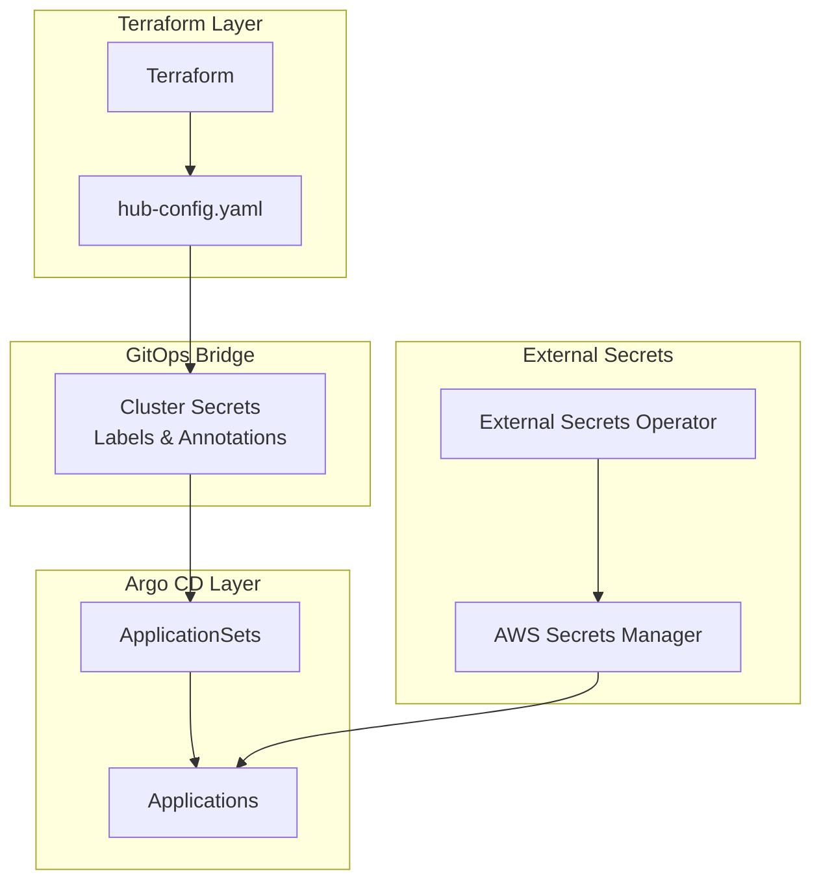

# GitOps Bridge Architecture

This document explains how the platform uses the GitOps Bridge pattern to dynamically deploy addons across multiple EKS clusters using Argo CD ApplicationSets, cluster secrets, and External Secrets Operator.

## Overview

The GitOps Bridge is a data pipeline that passes infrastructure metadata from Terraform to Kubernetes secrets. Argo CD ApplicationSets then use these cluster secrets to dynamically determine which addons to deploy to each cluster.



## Three-Tier Configuration System

The platform uses a three-tier GitOps configuration system:

### 1. Addon Definitions

Located in `gitops/addons/bootstrap/default/addons.yaml`, this is the central registry of all available platform addons:

```yaml
jupyterhub:
  enabled: false
  annotationsAppSet:
    argocd.argoproj.io/sync-wave: '5'
  namespace: jupyterhub
  chartName: jupyterhub
  chartRepository: https://hub.jupyter.org/helm-chart/
  defaultVersion: '3.3.7'
  selector:
    matchExpressions:
      - key: enable_jupyterhub
        operator: In
        values: ['true']
  valuesObject:
    global:
      resourcePrefix: '{{.metadata.annotations.resource_prefix}}'
      ingress_domain_name: '{{.metadata.annotations.ingress_domain_name}}'
```

### 2. Environment Configuration

Located in `gitops/addons/environments/{environment}/addons.yaml`, this enables addons for specific environments:

```yaml
jupyterhub:
  enabled: true
keycloak:
  enabled: true
backstage:
  enabled: true
```

### 3. Cluster Configuration

Located in `platform/infra/terraform/hub-config.yaml`, this defines per-cluster addon activation:

```yaml
clusters:
  hub:
    addons:
      enable_jupyterhub: true
      enable_keycloak: true
      enable_backstage: true
  spoke-dev:
    addons:
      enable_jupyterhub: false
      enable_keycloak: false
```

## Cluster Secrets

Terraform creates Kubernetes secrets for each cluster with labels and annotations that ApplicationSets use for dynamic configuration.

### Labels (for addon selection)

```yaml
metadata:
  labels:
    environment: control-plane
    tenant: platform-team
    enable_jupyterhub: "true"
    enable_keycloak: "true"
    enable_backstage: "true"
```

### Annotations (for templating)

```yaml
metadata:
  annotations:
    resource_prefix: peeks
    ingress_domain_name: platform.example.com
    aws_region: us-west-2
    aws_cluster_name: peeks-hub-cluster
    addons_repo_basepath: gitops/addons/
```

## ApplicationSet Dynamic Generation

Argo CD ApplicationSets use cluster secret labels to determine which addons to deploy:

```yaml
apiVersion: argoproj.io/v1alpha1
kind: ApplicationSet
metadata:
  name: addon-jupyterhub
spec:
  generators:
  - clusters:
      selector:
        matchLabels:
          enable_jupyterhub: "true"
  template:
    spec:
      source:
        helm:
          valuesObject:
            ingress:
              host: '{{.metadata.annotations.ingress_domain_name}}'
```

When a cluster secret has `enable_jupyterhub: "true"`, the ApplicationSet automatically generates an Application for that cluster.

## External Secrets Integration

The platform uses External Secrets Operator to sync secrets from AWS Secrets Manager into Kubernetes:

```yaml
apiVersion: external-secrets.io/v1
kind: ExternalSecret
metadata:
  name: keycloak-credentials
spec:
  secretStoreRef:
    name: aws-secrets-manager
    kind: ClusterSecretStore
  target:
    name: keycloak-credentials
  data:
    - secretKey: admin-password
      remoteRef:
        key: '{{.metadata.annotations.aws_cluster_name}}/secrets'
        property: keycloak_admin_password
```

### Secret Naming Convention

Secrets follow a predictable naming pattern:

```
{resource_prefix}-{service}-{type}-password
```

Examples:
- `peeks-keycloak-admin-password`
- `peeks-backstage-postgresql-password`
- `peeks-gitlab-root-password`

## Sync Wave Orchestration

Addons use Argo CD sync waves to ensure proper deployment ordering. Lower wave numbers deploy first, and each wave waits for the previous wave to be healthy before proceeding.

### Sync Wave Reference

| Wave | Components | Dependencies | Purpose |
|------|-----------|--------------|---------|
| **-5** | multi-acct | None | Multi-account role mapping for ACK controllers |
| **-3** | kro | None | Kubernetes Resource Orchestrator for custom resources |
| **-2** | kro-manifests, kro-manifests-hub | kro | Kro ResourceGraphDefinitions and schemas |
| **-1** | ACK controllers (EC2, EKS, IAM, ECR, S3, DynamoDB), external-secrets, platform-manifests-bootstrap | kro-manifests | AWS resource management and secret sync |
| **0** | argocd, metrics-server, ingress-class-alb, ack-efs | ACK controllers | Core platform services |
| **1** | ingress-nginx, image-prepuller | Core services | Ingress and image caching |
| **2** | cert-manager, gitlab | Ingress | TLS certificates and Git repository |
| **3** | keycloak, kubevela, kyverno, monitoring stack | Ingress, GitLab | Identity management and policy enforcement |
| **4** | backstage, argo-workflows, kargo, grafana, flux, kyverno-policies, aws-efs-csi-driver | Keycloak | Developer tools and storage |
| **5** | crossplane, ML/AI tools (airflow, jupyterhub, kubeflow, mlflow, ray-operator, spark-operator) | Keycloak | Infrastructure provisioning and data science |
| **6** | crossplane-aws, platform-manifests | Crossplane | AWS provider configurations |
| **7** | devlake | Crossplane-AWS | Engineering metrics and analytics |

### Recent Optimizations (2026-02-07)

The following addons were moved to earlier waves to reduce setup time by ~6-7 minutes:

- **Backstage**: Wave 10 → 4 (only depends on Keycloak)
- **Devlake**: Wave 10 → 7 (only depends on Crossplane-AWS)
- **Argo Workflows**: Wave 6 → 4 (only depends on Keycloak)
- **Kargo**: Wave 6 → 4 (only depends on Keycloak)

These changes allow addons to deploy in parallel with other services instead of waiting sequentially.

### Sync Wave Best Practices

1. **Minimize dependencies**: Only wait for services you actually depend on
2. **Group by dependency**: Services with the same dependencies can share a wave
3. **Infrastructure first**: Core infrastructure (ACK, Kro) deploys in negative waves
4. **Identity before apps**: Keycloak (wave 3) before apps needing SSO (wave 4+)
5. **Providers after core**: Crossplane providers (wave 6) after Crossplane core (wave 5)

## Deployment Flow

1. **Terraform** reads `hub-config.yaml` and creates cluster secrets with appropriate labels
2. **Cluster secrets** are created in the `argocd` namespace with addon enablement labels
3. **ApplicationSets** detect clusters matching their label selectors
4. **Applications** are generated for each matching cluster
5. **Helm charts** are deployed with values templated from cluster annotations
6. **External Secrets** sync credentials from AWS Secrets Manager
7. **Addons** start with proper configuration and authentication

## Adding a New Addon

1. Define the addon in `gitops/addons/bootstrap/default/addons.yaml`
2. Enable in environment config `gitops/addons/environments/{env}/addons.yaml`
3. Add enablement flag to `platform/infra/terraform/hub-config.yaml`
4. Apply Terraform changes to update cluster secrets
5. Argo CD automatically detects and deploys the addon

## References

- [GitOps Bridge Project](https://github.com/gitops-bridge-dev/gitops-bridge)
- [Argo CD ApplicationSets](https://argo-cd.readthedocs.io/en/stable/operator-manual/applicationset/)
- [External Secrets Operator](https://external-secrets.io/)
