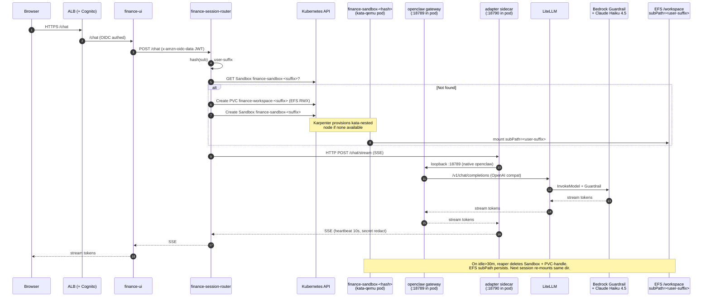

# Finance Assistant

Per-user AI financial reasoning assistant running in a Kata VM. ALB + Cognito for auth, Server-Sent Events for streaming chat, persistent EFS-backed `/workspace` so context survives across sessions.

## Flow



## Per-user lifecycle

1. **First request from user X**: router hashes `sub` claim into `suffix`. Creates `PersistentVolumeClaim finance-workspace-<suffix>` (EFS RWX) and `Sandbox finance-sandbox-<suffix>` from a template ConfigMap. Karpenter provisions a kata node if needed. Pod starts, mounts EFS at `/workspace` with `subPath=<suffix>`. openclaw gateway boots, reads its rendered config, binds `:18789`.
2. **Subsequent requests**: router finds existing Sandbox, proxies SSE stream directly.
3. **Idle > 30 min**: reaper CronJob deletes the Sandbox. EFS PVC is kept. `goals.md`, `snapshot.md`, `scenarios/*.md`, `decisions.md`, `questions.md`, and openclaw's `sessions/*.jsonl` all remain.
4. **User returns**: router stamps a new Sandbox with same `suffix`, pod re-mounts the same EFS subPath, all context is back.

## What's in /workspace

| File | Purpose |
|---|---|
| `goals.md` | User-stated financial goals, horizon, priorities |
| `snapshot.md` | Self-reported financial picture, dated |
| `scenarios/*.md` | Saved scenario models |
| `decisions.md` | Log of material decisions the user made |
| `questions.md` | Open items for a licensed pro |
| `sessions/*.jsonl` | openclaw chat history (cross-turn memory) |

## Customize the system prompt

Edit `gitops/usecases/finance-assistant/system-prompt-configmap.yaml`. ArgoCD reconciles and the next pod boot reads the new prompt. Existing workspaces are preserved.

## Security posture

- Kata-qemu VM isolation (own kernel)
- Non-root, readOnlyRootFilesystem where possible, all caps dropped, seccomp RuntimeDefault
- NetworkPolicy: egress only to litellm:4000 and kube-dns:53
- Secrets via tmpfs projected volume, mode 0400 (no env vars → never show in `env`)
- Adapter redacts `sk-*`, `AKIA*`, JWTs, hashes, base64 blobs from every stream
- Bedrock Guardrail enforces PII anonymization + content filtering
- LiteLLM → Bedrock via Pod Identity (no IAM keys at rest)

## Troubleshooting

```bash
# see all user sandboxes
kubectl get sandbox -n finance-assistant

# router logs (routing decisions, creation events)
kubectl logs -n finance-assistant -l app=finance-session-router --tail=50

# a specific user's sandbox
kubectl logs -n finance-assistant finance-sandbox-<suffix> -c openclaw --tail=50
kubectl logs -n finance-assistant finance-sandbox-<suffix> -c adapter  --tail=50

# LiteLLM health
kubectl get pods -n litellm
kubectl logs -n litellm -l app.kubernetes.io/name=litellm --tail=30
```
