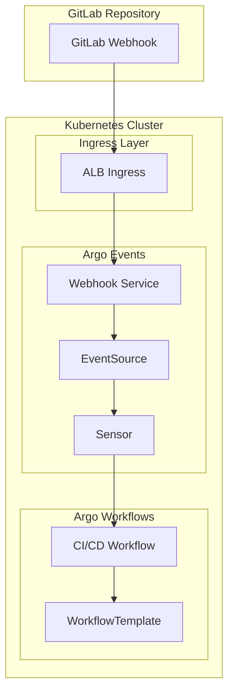

# GitLab Webhook Integration with Argo Events

## Overview

This document describes the GitLab webhook integration implementation for the Kro-based CI/CD pipeline. The integration uses Argo Events to receive GitLab webhooks and trigger Argo Workflows for CI/CD operations.

## Architecture



## Components

### 1. Argo Events EventSource

**Resource**: `EventSource`
**Name**: `{app-name}-cicd-gitlab-eventsource`
**Purpose**: Receives GitLab webhook events

**Configuration**:
- Listens on port 12000
- Endpoint: `/webhook`
- Method: POST
- Service exposure for internal cluster access

### 2. Argo Events Sensor

**Resource**: `Sensor`
**Name**: `{app-name}-cicd-gitlab-sensor`
**Purpose**: Processes webhook events and triggers workflows

**Filters**:
- `object_kind`: "push"
- `ref`: "refs/heads/main"

**Triggers**:
- Creates new Argo Workflow instances
- Uses WorkflowTemplate reference
- Passes git parameters from webhook payload

### 3. Webhook Service

**Resource**: `Service`
**Name**: `{app-name}-cicd-webhook-service`
**Purpose**: Exposes EventSource internally

**Configuration**:
- Type: ClusterIP
- Port: 80 → 12000
- Selector: EventSource pods

### 4. Webhook Ingress

**Resource**: `Ingress`
**Name**: `{app-name}-cicd-webhook-ingress`
**Purpose**: Exposes webhook endpoint externally

**Configuration**:
- Class: ALB (AWS Load Balancer)
- Scheme: Internet-facing
- Path: `/argo-events/{app-name}`
- Target: Webhook Service

## Webhook Configuration Process

### 1. Automatic Configuration

The CI/CD setup workflow automatically configures GitLab webhooks:

```bash
# Webhook URL format
http://{gitlab-hostname}/argo-events/{app-name}

# GitLab API call
POST /api/v1/repos/{username}/{repo-name}/hooks
{
  "branch_filter": "main",
  "type": "gitea",
  "events": ["push"],
  "config": {
    "url": "http://{hostname}/argo-events/{app-name}",
    "content_type": "json",
    "http_method": "POST"
  },
  "active": true
}
```

### 2. Manual Configuration

If automatic configuration fails, manually configure the webhook:

1. Navigate to GitLab repository settings
2. Go to Webhooks section
3. Add new webhook with:
   - URL: `http://{gitlab-hostname}/argo-events/{app-name}`
   - Content Type: `application/json`
   - Events: Push events
   - Branch filter: `main`

## Event Flow

### 1. GitLab Push Event

When code is pushed to the main branch:

```json
{
  "object_kind": "push",
  "ref": "refs/heads/main",
  "commits": [
    {
      "id": "commit-sha",
      "message": "commit message"
    }
  ],
  "repository": {
    "name": "repo-name",
    "url": "repo-url"
  }
}
```

### 2. EventSource Processing

EventSource receives the webhook and validates:
- HTTP method is POST
- Content-Type is application/json
- Payload structure is valid

### 3. Sensor Filtering

Sensor applies filters:
- `object_kind` must be "push"
- `ref` must be "refs/heads/main"

### 4. Workflow Trigger

If filters pass, Sensor creates new Workflow:

```yaml
apiVersion: argoproj.io/v1alpha1
kind: Workflow
metadata:
  generateName: {app-name}-cicd-
  namespace: {namespace}
spec:
  serviceAccountName: {app-name}-cicd-sa
  workflowTemplateRef:
    name: {app-name}-cicd-workflow
  arguments:
    parameters:
      - name: git-url
        value: "https://{hostname}/{username}/{repo-name}.git"
      - name: git-revision
        value: "main"
      - name: repo-name
        value: "{repo-name}"
```

## Configuration Parameters

### Required Parameters

| Parameter          | Description            | Example              |
|--------------------|------------------------|----------------------|
| `gitlab.hostname`  | GitLab server hostname | `gitlab.example.com` |
| `gitlab.username`  | GitLab username        | `developer`          |
| `application.name` | Application name       | `myapp`              |

### Generated Resources

| Resource Type | Name Pattern                | Purpose           |
|---------------|-----------------------------|-------------------|
| EventSource   | `{name}-gitlab-eventsource` | Webhook receiver  |
| Sensor        | `{name}-gitlab-sensor`      | Event processor   |
| Service       | `{name}-webhook-service`    | Internal exposure |
| Ingress       | `{name}-webhook-ingress`    | External exposure |

## Monitoring and Troubleshooting

### 1. Check EventSource Status

```bash
kubectl get eventsource {app-name}-cicd-gitlab-eventsource -n {namespace}
kubectl describe eventsource {app-name}-cicd-gitlab-eventsource -n {namespace}
```

### 2. Check Sensor Status

```bash
kubectl get sensor {app-name}-cicd-gitlab-sensor -n {namespace}
kubectl describe sensor {app-name}-cicd-gitlab-sensor -n {namespace}
```

### 3. View EventSource Logs

```bash
kubectl logs -l eventsource-name={app-name}-cicd-gitlab-eventsource -n {namespace}
```

### 4. View Sensor Logs

```bash
kubectl logs -l sensor-name={app-name}-cicd-gitlab-sensor -n {namespace}
```

### 5. Test Webhook Endpoint

```bash
# Internal test
kubectl run webhook-test --rm -i --restart=Never --image=alpine:3.20 -- sh -c "
  apk add curl
  curl -X POST http://{app-name}-cicd-webhook-service.{namespace}.svc.cluster.local/webhook \
    -H 'Content-Type: application/json' \
    -d '{\"object_kind\":\"push\",\"ref\":\"refs/heads/main\"}'
"

# External test
curl -X POST http://{gitlab-hostname}/argo-events/{app-name} \
  -H 'Content-Type: application/json' \
  -d '{"object_kind":"push","ref":"refs/heads/main","commits":[{"id":"test123"}]}'
```

## Security Considerations

### 1. Network Security

- Ingress uses ALB with internet-facing scheme
- Internal communication uses ClusterIP services
- EventSource validates webhook payload structure

### 2. RBAC Permissions

Service account has minimal required permissions:
- Read EventSources and Sensors
- Create and manage Workflows
- Access ConfigMaps and Secrets in namespace

### 3. Webhook Security

- Consider adding webhook secret validation
- Implement IP allowlisting if needed
- Monitor webhook access logs

## Validation

Use the provided validation script:

```bash
./tests/validate-webhook-integration.sh {namespace} {app-name} {gitlab-hostname}
```

The script validates:
- Kro instance status
- EventSource readiness
- Sensor readiness
- Service availability
- Ingress configuration
- RBAC permissions
- ConfigMap configuration

## Common Issues

### 1. EventSource Not Ready

**Symptoms**: EventSource status shows not ready
**Solutions**:
- Check EventSource logs for errors
- Verify service account permissions
- Ensure namespace exists and is active

### 2. Webhook Not Triggering Workflows

**Symptoms**: GitLab webhook fires but no workflows created
**Solutions**:
- Check Sensor filters match webhook payload
- Verify Sensor logs for processing errors
- Ensure WorkflowTemplate exists and is valid

### 3. Ingress Not Accessible

**Symptoms**: External webhook calls fail
**Solutions**:
- Check ALB provisioning status
- Verify ingress annotations
- Ensure security groups allow HTTP traffic

### 4. Permission Denied Errors

**Symptoms**: Sensor cannot create workflows
**Solutions**:
- Check service account RBAC permissions
- Verify role bindings are correct
- Ensure service account exists

## Migration from Direct GitLab Integration

### Changes Made

1. **Webhook Endpoint**: Changed from direct GitLab API to Argo Events
2. **Event Processing**: Added EventSource and Sensor for event handling
3. **Workflow Triggering**: Workflows now triggered by Sensor instead of direct calls
4. **Network Exposure**: Added Ingress for external webhook access

### Compatibility

- Maintains same GitLab webhook configuration API
- Preserves existing workflow parameters and structure
- Compatible with existing GitLab repository settings

### Benefits

- **Reliability**: Better error handling and retry mechanisms
- **Scalability**: Can handle multiple concurrent webhook events
- **Observability**: Better logging and monitoring of webhook events
- **Flexibility**: Easy to add additional event sources or processing logic